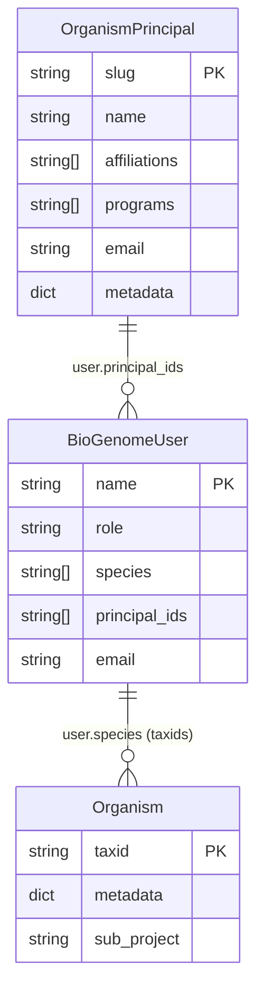
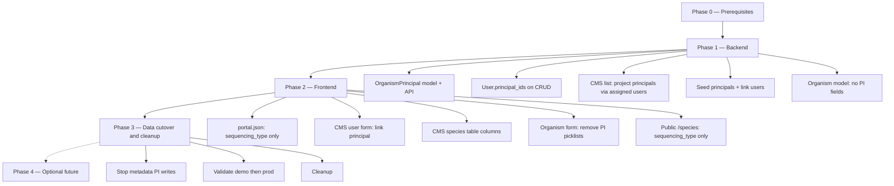

# CBP PI / OrganismPrincipal migration plan

Phased end-to-end migration from legacy `sub_project` and config-driven
`metadata.PIs` / `metadata.institute` / `metadata.project` picklists toward a
**principal catalog linked only through curator accounts**, where:

- An **`OrganismPrincipal`** is a first-class database row for the funding/scientific
  authority (CBP: Principal Investigator). It stores `name`, `affiliations`, and
  optional `programs`. PIs **without** a CMS login still get a principal row.
- A **`BioGenomeUser`** (curator) optionally links to one or more principals via
  `principal_ids`. The PI who logs in links to their own principal; a worker under
  a PI links to that PI’s principal.
- **`Organism` rows stay untouched** for PI attribution — no `principal_ids` on
  organisms. Species inherit PI / institute / project by projecting through
  **assigned curators** (`BioGenomeUser.species` → `principal_ids` →
  `OrganismPrincipal`).
- The organism create/edit form does **not** ask for a PI. Assigning a curator who
  is already linked to a principal is enough — no duplicated effort per species.
- **`portal.json`** keeps only **`sequencing_type`** as a config-defined custom
  metadata field. PI / institute / project are **not** portal config enums.
- **Public UI** (`/species`) exposes a **`sequencing_type` filter only** — no PI /
  institute / project filters or display on public cards or detail pages in this
  migration.
- **CMS UI** projects PI → institute → project in the **species overview table**
  (`SpeciesOverviewModule`) only, derived from assigned users’ principals.

Platform code uses **`OrganismPrincipal`** / **`principal_ids`** (on users only) /
**`affiliations`** / **`programs`**. CBP-facing UI labels remain **PI**,
**Institute**, **Project**.

For background on the current portal-config model see
[portal-configuration.md](./portal-configuration.md). For the interim metadata
backfill script see `bgp-scripts/cbp/migrate_pi_institute_project_metadata.py`
(to be superseded by principal seeding + user linking in Phase 1).

---

## 1. Target architecture

### 1.1 Data model



| Field | Location | Purpose |
| --- | --- | --- |
| `OrganismPrincipal` | New MongoEngine document | Canonical PI row; affiliations and programs live here |
| `BioGenomeUser.principal_ids` | BioGenomeUser (optional) | Links curator account to PI principal(s) |
| `BioGenomeUser.species` | BioGenomeUser (keep) | Per-taxid assignment; **also** the bridge for PI projection onto species |
| `Organism` | **No new PI fields** | Unchanged for attribution; CMS derives PI via assigned users |
| `Organism.metadata.sequencing_type` | Organism metadata | Closed enum from `portal.json`; unchanged |
| `Organism.sub_project` | Organism (keep, legacy) | Not removed; stop writing for CBP; fallback read only |
| `BioGenomeUser.sub_projects` | BioGenomeUser (unused) | Dead field today; do not use; optional cleanup later |

### 1.2 How species get a PI (projection path)

```text
Organism (taxid)
    ↑ listed in
BioGenomeUser.species          ← curator assignment (already exists)
    ↓ principal_ids
OrganismPrincipal              ← name, affiliations, programs
```

CMS species table for taxid `317549`:

1. Find users where `317549 ∈ user.species` (already exposed as `assigned_users`).
2. For each such user, resolve `user.principal_ids` → `OrganismPrincipal` docs.
3. Deduplicate principals; show PI name(s), unique affiliations, unique programs.

**Grouping species by PI:** find all users with that principal slug in
`principal_ids`, then union their `species` taxids.

### 1.3 Separation of concerns

| Concern | Mechanism |
| --- | --- |
| **PI details (name, institute, project)** | `OrganismPrincipal` catalog only |
| **Who can edit a species** | `Admin` **or** `taxid ∈ user.species` (unchanged) |
| **Which PI “owns” a species in CMS** | Derived: assigned curators → their `principal_ids` |
| **Authentication** | `BioGenomeUser.name` + password |
| **Public discovery filter** | `metadata.sequencing_type` only |
| **CMS species table display** | API returns projected `principals[]` on organism list rows |

Login identity and PI identity stay separate: a worker (`matteo_agazzi`) linked to
Javier’s principal can edit Javier’s species; audit logs still record the worker.

**Design premise:** CMS curator assignment ≈ portal ownership for grouping. Species
without assigned curators show no PI until someone is assigned. That is intentional
and avoids tagging every organism with a PI in the form.

### 1.4 Actor patterns

| Actor | `OrganismPrincipal` row? | `BioGenomeUser`? | `user.principal_ids` | How species get PI |
| --- | --- | --- | --- | --- |
| PI with login | Yes | Yes (same person) | Own principal slug | Assign this user to species |
| Worker under PI | Yes (the PI’s row) | Yes (worker) | PI’s slug | Assign worker to species |
| PI without login | Yes | No | — | Assign any curator linked to that principal (e.g. admin-created worker/helper, or later a dedicated curator) |

### 1.5 `portal.json` after migration (CBP)

```json
"cms": {
  "organisms": {
    "requiredSteps": ["goatStatus", "piOrEntity", "images"],
    "fields": [
      {
        "key": "sequencing_type",
        "label": "Sequencing type",
        "type": "multi",
        "step": "sequencingAndSubproject",
        "required": false,
        "values": ["ONT (Long Reads)", "..."]
      }
    ]
  }
}
```

Remove `PIs`, `institute`, and `project` from `cms.organisms.fields` in Phase 2.

**Note on `piOrEntity` step:** after this migration the step no longer collects PI
picklists. Options for Phase 2:

- Drop `piOrEntity` from `requiredSteps` for CBP (preferred if the step becomes empty), or
- Repurpose the step for residual free-text / notes only if still needed, or
- Keep the step id for non-CBP portals that still use `sub_project` fallback.

Default recommendation: CBP removes `piOrEntity` from `requiredSteps` once PI
picklists are gone; curator assignment remains on the CMS users / species table
flows.

---

## 2. Current state (baseline)

| Area | Current behaviour |
| --- | --- |
| `sequencing_type` | In `metadata.sequencing_type`; backfill job `organisms.backfill_sequencing_type_metadata` |
| `sub_project` | Top-level string on `Organism`; CMS fallback when no custom fields |
| `metadata.PIs` / `institute` / `project` | Interim arrays; `migrate_pi_institute_project_metadata.py` |
| `portal.json` fields | Static picklists for PIs, institute, project, sequencing_type |
| Public `/species` | Custom-field filters for every configured field |
| CMS species table | Species, GoaT, Target, Curators, Actions — **no PI columns** |
| CMS organism form | `piOrEntity`: custom picklists **or** free-text `sub_project` |
| Access control | Admin or `taxid in user.species` |
| Curator assignment | `BioGenomeUser.species` + CMS user panel / curators cell |
| `user.sub_projects` | Defined, never read |

---

## 3. Migration phases overview



| Phase | Scope | Deployable alone? |
| --- | --- | --- |
| **0** | Confirm assignment≈ownership; demo plan | Yes |
| **1** | Principal model/API; user link; CMS list projection; seed scripts | Yes (additive) |
| **2** | Frontend CMS + public filter; form trim | Yes (needs Phase 1) |
| **3** | Cutover, stop legacy metadata writes | Yes |
| **4** | Public PI UI, optional access-by-principal | Future |

**Order:** backend (Phase 1) **before** frontend (Phase 2).

---

## 4. Phase 0 — Prerequisites and decisions

### 4.1 Confirm domain rules

- [ ] `OrganismPrincipal` is the only store for PI name / affiliations / programs.
- [ ] `BioGenomeUser.principal_ids` is the only link from accounts to principals.
- [ ] **`Organism` does not gain `principal_ids`** (or any PI foreign keys).
- [ ] Species PI in CMS = unique principals of users who have that taxid in `species`.
- [ ] Unassigned species show empty PI columns until a curator is assigned.
- [ ] Co-PI / multi-principal: either multiple assigned curators with different
      `principal_ids`, or one curator with multiple `principal_ids` (document which
      CBP will use; TSV has ~3 co-PI rows).
- [ ] Slug convention: lowercase ASCII from PI name (`javier-del-campo`); `name`
      keeps accented display form.
- [ ] Access control stays Admin / `user.species` for this migration (no new
      “edit all species under my principal” rule unless added later).

### 4.2 Environments

1. Implement and seed on **CBP demo**.
2. Validate CMS table, user linking, public filter.
3. Repeat on **CBP prod**.

### 4.3 Rollback

Phase 1 is additive (new collection + optional `principal_ids` on users). Rollback =
stop writing `principal_ids`, revert frontend; organisms and legacy metadata
unchanged.

---

## 5. Phase 1 — Backend

Platform-generic naming (`OrganismPrincipal`, not `CbpPI`). CBP is the first consumer.

### 5.1 Model (`server/db/model.py`)

Add:

```python
class OrganismPrincipal(db.Document):
    slug = db.StringField(required=True, unique=True)
    name = db.StringField(required=True)
    affiliations = db.ListField(db.StringField())
    programs = db.ListField(db.StringField())
    email = db.StringField()
    metadata = db.DictField()
    meta = {"indexes": ["slug", "name"]}
```

Add to `BioGenomeUser` only:

```python
principal_ids = db.ListField(db.StringField())
```

**Do not** add `principal_ids` (or similar) to `Organism`.

**Do not remove** `sub_project`, organism `metadata`, or `BioGenomeUser.sub_projects`
in this phase.

### 5.2 Principal REST API

| Method | Path | Auth | Purpose |
| --- | --- | --- | --- |
| `GET` | `/api/organism_principals` | public or Admin | Paginated list; search by name |
| `GET` | `/api/organism_principals/<slug>` | public or Admin | Single principal |
| `POST` | `/api/organism_principals` | Admin | Create PI row |
| `PUT` | `/api/organism_principals/<slug>` | Admin | Update affiliations/programs/name |
| `DELETE` | `/api/organism_principals/<slug>` | Admin | Hard delete; cascades cleanup of `BioGenomeUser.principal_ids` |

Response shape:

```json
{
  "slug": "javier-del-campo",
  "name": "Javier del Campo",
  "affiliations": ["Institut de Biologia Evolutiva (IBE)"],
  "programs": ["Genomes for Mediterranean Corals Conservation (GEMECC)"],
  "email": null
}
```

Implement under `server/services/organism_principals.py` and
`server/rest/organism_principals.py`; wire in `server/routes.py`.

Optional: `GET /api/organism_principals/options` → `{slug, name}` for user-form
combobox.

### 5.3 User CRUD

Extend `server/services/users.py` `create_user` / `update_user`:

- Accept optional `principal_ids` list.
- Validate slugs exist on `OrganismPrincipal`.
- Persist on `BioGenomeUser`.
- Include `principal_ids` in user list/detail responses (exclude password as today).

### 5.4 CMS organism list projection (via assigned users)

Endpoints already used by the CMS species table:

- `GET /api/organisms/with_users`
- `GET /api/organisms/all_with_users`
- `GET /api/organisms/unassigned`

Extend `_organism_row_with_users` (or equivalent) in `server/services/organisms.py`:

1. Keep building `assigned_users` from users whose `species` contain the taxid
   (existing behaviour).
2. For those users, collect `principal_ids`, batch-load `OrganismPrincipal` docs.
3. Attach deduplicated `principals[]` on each organism row.

Example response fragment:

```json
{
  "taxid": "317549",
  "scientific_name": "...",
  "assigned_users": ["matteo_agazzi"],
  "principals": [
    {
      "slug": "javier-del-campo",
      "name": "Javier del Campo",
      "affiliations": ["Institut de Biologia Evolutiva (IBE)"],
      "programs": ["Genomes for Mediterranean Corals Conservation (GEMECC)"]
    }
  ]
}
```

Implementation notes:

- Batch-load principals for the page (avoid N+1).
- Deduplicate by slug when multiple curators share the same principal.
- Unassigned organisms → `assigned_users: []`, `principals: []`.
- **Do not** put this projection on public `GET /api/organisms` unless Phase 4 needs it.
- **Do not** change organism create/update payloads for PI fields.

### 5.5 Organism create/update

**No changes** for PI attribution. Continue supporting `metadata` (including
`sequencing_type`) and legacy `sub_project` as today.

Do **not** add `principal_ids` to `_ORGANISM_PATCHABLE_FIELDS`.

### 5.6 Access control

**No change required** for Phase 1–2: keep `organism_access_required` as Admin or
`taxid in user.species`.

Optional later (Phase 4): allow edit if any of the user’s principals match any
principal of other assignees on that taxid — not required for grouping/display.

### 5.7 Optional: group-by-PI query helper

Useful for CMS filters / exports (can be Phase 1 or 2):

- `GET /api/organism_principals/<slug>/species` → taxids (union of `species` over
  users with that principal), or
- Query param on organisms-with-users: `principal_slug=javier-del-campo`.

Not blocking for the table columns if filtering is client-side initially.

### 5.8 Data seed scripts (`bgp-scripts/cbp/`)

Supersede `migrate_pi_institute_project_metadata.py` (organism metadata PI writes)
with:

#### `seed_organism_principals.py`

- Input: `CBP_taxid_PIs_institute_project.tsv`.
- Dedupe by PI name → ~53 `OrganismPrincipal` rows.
- Map TSV `institute` → `affiliations`, TSV `project` → `programs`.
- Apply `PI_CANONICAL` as in `build_organism_fields.py`.
- Idempotent upsert; `--dry-run`; default demo URL.

#### `link_users_to_principals.py`

- Map CBP users → principal slugs (email heuristics + optional override TSV).
- Workers under a PI get that PI’s slug in `principal_ids`.
- PIs who have accounts get their own slug.
- `PUT /api/users/<name>` with `{"principal_ids": [...]}`.
- Does **not** write organism documents.

#### Optional validation helper

- Cross-check TSV taxid ↔ PI against demo/prod: for each taxid, at least one
  assigned user should eventually link to the expected principal (report gaps;
  do not auto-assign species unless explicitly requested).

Validate on demo:

```bash
cd bgp-scripts/cbp
python3 seed_organism_principals.py --dry-run
python3 link_users_to_principals.py --dry-run
```

### 5.9 Phase 1 checklist

- [ ] `OrganismPrincipal` model + indexes
- [ ] `principal_ids` on `BioGenomeUser` only
- [ ] Principal CRUD API
- [ ] User create/update/list expose `principal_ids`
- [ ] CMS list endpoints return `principals[]` derived from assigned users
- [ ] Organism model/API: **no** new PI fields
- [ ] Seed + user-link scripts run clean on demo
- [ ] Unit tests: projection dedupe, empty assignees, batch load
- [ ] OpenAPI / schema notes if maintained

### 5.10 Phase 1 verification (API-only)

```bash
# List principals
curl -s "$BASE/api/organism_principals?limit=5" | jq .

# Link user to principal
curl -s -X PUT "$BASE/api/users/matteo_agazzi" \
  -H "Authorization: Bearer $TOKEN" \
  -H "Content-Type: application/json" \
  -d '{"principal_ids":["javier-del-campo"]}' | jq .

# CMS list projection (principals via assignees)
curl -s "$BASE/api/organisms/all_with_users?limit=5" \
  | jq '.data[] | {taxid, assigned_users, principals}'
```

---

## 6. Phase 2 — Frontend

Deploy after Phase 1 API is live on the target environment.

### 6.1 Portal config trim

**Files:** `bgp-configs/biogenome-portal-cbp/portal.json`,
`bgp-configs/biogenome-portal-cbp-demo/portal.json`.

- Remove `PIs`, `institute`, `project` from `cms.organisms.fields`.
- Keep only `sequencing_type`.
- Remove or adjust `piOrEntity` in `requiredSteps` (see §1.5).
- Drop `build_organism_fields.py` from operational runbooks (except optional
  sequencing_type enum generation).

### 6.2 CMS species table — PI projection

**Primary file:** `front/components/cms/dashboard/species-overview-module.tsx`

| Column (CBP label) | Source |
| --- | --- |
| **PI(s)** | `principals[].name` joined |
| **Institute(s)** | unique flat map of `principals[].affiliations` |
| **Project(s)** | unique flat map of `principals[].programs` |

Implementation:

- Read `principals` from API row (Phase 1 projection via assignees).
- Empty principals when unassigned — show em dash / “—” .
- No per-row frontend principal fetch.
- Admin and DataManager views both get the columns.
- Optional later: filter table by principal slug.

**Out of scope:** public `SpeciesCard`, public `/species/[id]` — no PI blocks.

### 6.3 CMS user admin — link account to principal

**Primary file:** `front/components/cms/drawer/user-form-panel.tsx`

- Fetch `/api/organism_principals/options`.
- Multi-select `principal_ids` on create/edit (optional).
- Help text: e.g. “Link this curator to a PI. Species assigned to this user will
  show that PI’s institute and project in the species table.”
- Keep existing species assignment UI (`user.species`).
- Optionally show principal affiliations/programs read-only when a principal is
  selected.

### 6.4 CMS organism form — remove PI picklists

**Primary file:** `front/components/cms/organism/organism-form-client.tsx`

| Before | After |
| --- | --- |
| `CustomPicklistField` for PIs / institute / project | **Removed** for CBP |
| Free-text `sub_project` when no custom fields | Keep only for portals with no sequencing custom fields / legacy; CBP should not require it |
| Review shows PI metadata arrays | Drop those review rows |

**Do not** add a principal picker to the organism form.

Keep `sequencingAndSubproject` (or renamed) for `sequencing_type` only via existing
custom-field machinery.

Update stepper (`use-organism-form-stepper.ts`) so `piOrEntity` is not required for
CBP once removed from config.

### 6.5 Public species list — sequencing_type only

**Entry:** `front/app/species/page.tsx` → `SpeciesListPageClient`

| UI element | After Phase 2 |
| --- | --- |
| Custom metadata filters | **Sequencing type only** |
| Sub-project filter | Hidden when any custom fields exist |
| PI / institute / project filters | **Absent** |
| Species cards | No PI line |

Tasks:

- [ ] Confirm only `sequencing_type` appears after config trim.
- [ ] Confirm facet stats for `metadata.sequencing_type`.
- [ ] Grep/remove dead public assumptions about `metadata.PIs` etc.

### 6.6 Public species detail / card

- No PI / institute / project block.
- Hide legacy `sub_project` card when CMS is enabled or when appropriate for CBP.
- Sequencing type: optional public display; not required for this migration.

### 6.7 CMS services / types

- `front/lib/cms/services/principals.ts` — list/options/CRUD wrappers.
- Extend user CMS types with `principal_ids`.
- Extend organism CMS list types with `principals[]` (projection only).

### 6.8 i18n

- CMS table: PI, Institute, Project.
- User form: principal link help text.
- Leave public sub-project keys if other portals need them.

### 6.9 Phase 2 checklist

- [ ] portal.json (cbp + cbp-demo): sequencing_type only; piOrEntity adjusted
- [ ] CMS species table shows PI / institute / project from `principals[]`
- [ ] CMS user form links `principal_ids`
- [ ] CMS organism form has no PI picklists / no principal picker
- [ ] Public `/species`: sequencing_type filter e2e
- [ ] Public cards/detail: no PI projection
- [ ] `tsc --noEmit` clean

### 6.10 Phase 2 E2E test plan (manual)

| # | Flow | Role | Expected |
| --- | --- | --- | --- |
| 1 | Open `/species` | public | Sequencing type filter; no PI filters |
| 2 | Filter by sequencing type | public | List narrows |
| 3 | Seed principal + link user | Admin | User has `principal_ids` |
| 4 | Assign user to species | Admin | Species table shows PI / institute / project |
| 5 | Unassign all curators | Admin | PI columns empty |
| 6 | Create/edit organism | DataManager | No PI step/pickers; sequencing type still works |
| 7 | Worker linked to PI edits species | worker | Can edit if in `user.species`; table still shows PI principal |
| 8 | Add new PI (no account) | Admin | Principal row exists; link a curator; assign species → columns fill |
| 9 | Public species detail | public | No PI block |
| 10 | Two curators, same principal | Admin | One deduped PI row on the species |

---

## 7. Phase 3 — Data cutover and cleanup

Demo first, then prod.

### 7.1 Cutover sequence

1. Deploy Phase 1 backend.
2. Run `seed_organism_principals.py`.
3. Run `link_users_to_principals.py`.
4. Spot-check CMS list projection for known taxids (assigned users → expected PI).
5. Deploy Phase 2 frontend + trimmed portal.json.
6. Smoke-test §6.10.
7. Optionally assign missing curators so TSV PI coverage appears in the table
   (manual or scripted species assignment — separate from principal seeding).

### 7.2 Stop legacy writes

- [ ] CMS form no longer writes `metadata.PIs` / `institute` / `project`.
- [ ] CMS form no longer writes `sub_project` for CBP.
- [ ] Deprecate `migrate_pi_institute_project_metadata.py` (header note: superseded
      by principal catalog + user linking).

### 7.3 Validation

- Principal count ≈ 53.
- Users that should map to PIs have non-empty `principal_ids`.
- Sample taxids with assignees show correct `principals[]`.
- Gap report: TSV taxids whose assignees have no principal link (or no assignees).
- Public sequencing_type filter counts unchanged.

### 7.4 Cleanup (once stable)

- [ ] Remove interim metadata PI keys from export presets if present.
- [ ] Remove operational dependency on `build_organism_fields.py` for PI lists.
- [ ] Document `sub_project` as deprecated for CBP.
- [ ] Consider removing unused `BioGenomeUser.sub_projects` in a later major version.
- [ ] Optional: leave legacy `metadata.PIs` in Mongo unread until a later purge job.

---

## 8. Phase 4 — Future (out of scope)

- Public `/species` filters by PI / institute / project.
- Public species detail PI block.
- Principal admin UI in CMS drawer (until then: scripts + API + user form link).
- Access rule: edit any species assigned to any user sharing my principal.
- Dedicated “group by PI” CMS view / export.
- Auto-suggest curator assignment from TSV during cutover.

---

## 9. File touch reference

### Backend (Phase 1)

| File | Change |
| --- | --- |
| `server/db/model.py` | `OrganismPrincipal`; `principal_ids` on **BioGenomeUser only** |
| `server/services/organism_principals.py` | **new** |
| `server/rest/organism_principals.py` | **new** |
| `server/routes.py` | register routes |
| `server/services/users.py` | `principal_ids` on create/update/list |
| `server/services/organisms.py` | CMS list projection `principals[]` via assignees; **no** organism PI fields |
| `server/wrappers/organism_access.py` | unchanged (unless Phase 4) |

### Frontend (Phase 2)

| File | Change |
| --- | --- |
| `front/components/cms/dashboard/species-overview-module.tsx` | PI / institute / project columns from `principals[]` |
| `front/components/cms/drawer/user-form-panel.tsx` | link `principal_ids` |
| `front/components/cms/organism/organism-form-client.tsx` | remove PI picklists; no principal picker |
| `front/hooks/use-organism-form-stepper.ts` | drop/adjust piOrEntity for CBP |
| `front/lib/cms/services/principals.ts` | **new** |
| `front/components/species-list/species-list-page-client.tsx` | sequencing-only filters |
| `front/app/species/page.tsx` | no change expected |
| `front/app/species/[id]/page.tsx` | confirm no PI display |
| `front/components/species-card.tsx` | confirm no PI display |

### Config / scripts

| File | Change |
| --- | --- |
| `bgp-configs/biogenome-portal-cbp/portal.json` | sequencing_type only; adjust requiredSteps |
| `bgp-configs/biogenome-portal-cbp-demo/portal.json` | same |
| `bgp-scripts/cbp/seed_organism_principals.py` | **new** |
| `bgp-scripts/cbp/link_users_to_principals.py` | **new** |

**Not created:** organism `principal_ids` migrate script (organisms stay untouched).

---

## 10. Risk register

| Risk | Mitigation |
| --- | --- |
| Unassigned species show no PI | Accepted; assign curators; gap report in Phase 3 |
| Wrong curator → wrong PI | Fix user↔principal link or reassign curator |
| Multiple curators, different principals | Show all unique principals; clarify co-PI policy |
| Worker not linked to principal | Species editable but PI columns empty until linked |
| Public filter regression | Phase 2 tests; only sequencing_type in config |
| CMS list N+1 | Batch principal load in list endpoint |
| Rollback | Additive Phase 1; revert frontend; organisms unchanged |

---

## 11. Related work already done

Still valid and not superseded:

- `sequencing_type` in `metadata.sequencing_type`; model field removed.
- Backfill task `organisms.backfill_sequencing_type_metadata`.
- MongoEngine `strict=False` safety for leftover top-level keys.
- Sub-project public filter hidden when custom fields are configured.

This document **supersedes**:

- Interim organism metadata PI picklists (`metadata.PIs` / institute / project as
  CMS source of truth).
- Earlier draft of this plan that put `principal_ids` on **Organism** and a PI
  picker on the organism form.

---

## 12. Summary

| Layer | What changes |
| --- | --- |
| **Database** | New `OrganismPrincipal`; `principal_ids` on **users only**; **organisms unchanged** |
| **API** | Principal CRUD; user link; CMS list projects `principals[]` via assignees |
| **portal.json** | `sequencing_type` only |
| **CMS table** | PI → institute → project from assigned curators’ principals |
| **CMS user form** | Link curator → principal |
| **CMS organism form** | No PI fields; sequencing type only |
| **Public `/species`** | Sequencing type filter only |
| **Public detail/cards** | No PI display |

**Effort saving:** manage PI details once on `OrganismPrincipal`, link curators once,
assign species as today — no per-species PI question on the organism form.

Implement **Phase 1 (backend)** before **Phase 2 (frontend)**. Validate on
**cbp-demo** before **cbp prod**.
