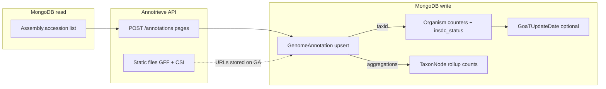

# Celery job: Annotrieve annotations import (`jobs/annotrieve.py`)

Reference for agents: end-to-end behavior, data flow, files, and MongoDB models.

## Entry point

| Symbol | Celery name | Role |
|--------|-------------|------|
| `import_annotations_from_annotrieve` | `annotations_import_from_annotrieve` | Pull annotations from CRG Annotrieve API for every assembly in DB |

---

## Environment and configuration

| Variable | Default | Role |
|----------|---------|------|
| `ANNOTRIEVE_ACCESSION_BATCH` | `200` | Assembly accessions per POST body |
| (internal) `_BULK_CHUNK` | `500` | `bulk_write` chunk size to Mongo |

From `clients/annotrieve_client.py`:

| Variable | Purpose |
|----------|---------|
| `ANNOTRIEVE_ANNOTATIONS_URL` | POST endpoint for annotation pages |
| `ANNOTRIEVE_FILES_BASE` | Base URL for GFF/tab index files (`file_url`) |

---

## Purpose

For **each** `Assembly.accession` in the database (deduplicated, stable order), call Annotrieve’s **annotations** API, map each row to a **`GenomeAnnotation`** upsert (`name` = `annotation_id`), then refresh **organism** and **TaxonNode** denormalized counts **without** copying lineages onto other collections and **without** inferring GoaT from pipeline data.

---

## Step-by-step

1. **`_collect_assembly_accessions`**
   - `Assembly.objects.scalar("accession")` → dedupe, strip, skip falsy → ordered list.

2. **Early exit** — if list empty → return `{status: no_assemblies, ...}`.

3. **Batch loop** — `create_batches(accessions, ANNOTRIEVE_ACCESSION_BATCH)`.

4. **Per batch**
   - `requests.Session()` (context manager around whole job).
   - `clients.annotrieve_client.fetch_annotations_for_assembly_accessions(session, batch)`:
     - Paginated POST (`post_annotations_page` with offset/limit); merges `results` until page shorter than limit.
   - For each API row → `_annotation_to_bulk_op(row)`:
     - **Required**: `annotation_id`, `taxid`, `assembly_accession`, `indexed_file_info.bgzipped_path`, `indexed_file_info.csi_path`.
     - Builds `gff_url` / `index_url` via `file_url` (Annotrieve files base + path).
     - **`$set`**: `name`, `assembly_accession`, `assembly_name`, `taxid` (str), `scientific_name`, `taxon_lineage` (from API list, stringified), `gff_gz_location`, `tab_index_location`, `metadata` = full row dict, `external=True`.
     - **`$setOnInsert`**: `created` = now.
     - Filter `{"name": name}`, `upsert=True`.
   - Collect distinct **`taxids_touched`** from rows that produced an op.
   - `GenomeAnnotation._get_collection().bulk_write(ops, ordered=False)` in chunks of `_BULK_CHUNK`.

5. **Denorm** — if `taxids_touched` non-empty:
   - `finalize_organism_catalog_for_taxids(sorted(taxids_touched), copy_lineages=False, apply_goat_inference=False)`.
   - **Why `copy_lineages=False`**: annotations job does not insert `ReadRun`/`BioSample`/`Assembly` rows; lineage on those collections is unrelated to this upsert.
   - **Why `apply_goat_inference=False`**: GoaT status is maintained elsewhere (e.g. GoaT file upload); this pass only refreshes **counts** (including `genome_annotations_count`) and **INSDC** tier from stored counts.

6. **Return** status, batch counts, upsert count, `taxids_synced`.

---

## Data flow diagram



**Note:** `GoaTUpdateDate` is only written when `derive_organism_denorm` sets `touch_goat_update_date`; with `apply_goat_inference=False` that path typically does not run for GoaT updates from counts.

---

## MongoDB models touched

| Model | Operation |
|-------|-----------|
| **Assembly** | **Read-only** (`scalar("accession")`) |
| **GenomeAnnotation** | `bulk_write` upsert by `name` |
| **Organism** | **Update** `assemblies_count`, `reads_count`, `biosamples_count`, `local_samples_count`, `genome_annotations_count`, `insdc_status`; conditional `goat_status` + `GoaTUpdateDate` only if inference applies (usually unchanged here) |
| **TaxonNode** | **Update** rollup count fields for species + lineage keys derived from those organisms |
| **BioSample**, **ReadRun**, **LocalSample** | **Read-only** in aggregation pipelines for organism counts |
| **GoaTUpdateDate** | Upsert only if status bulk touches GoaT |

---

## File dependency tree

```
jobs/annotrieve.py
├── clients/annotrieve_client.py
│   ├── fetch_annotations_for_assembly_accessions
│   ├── post_annotations_page / pagination
│   └── file_url → ANNOTRIEVE_FILES_BASE
├── db/model.py                    → Assembly, GenomeAnnotation
├── helpers/data.py                → create_batches
├── jobs/support/organism_catalog_sync.py → finalize_organism_catalog_for_taxids
│   ├── bulk_update_organism_counts_for_taxids   → counts from Assembly, ReadRun, BioSample, LocalSample, GenomeAnnotation
│   ├── bulk_update_taxon_node_counts_for_taxids
│   ├── bulk_update_organism_statuses_for_taxids → helpers/organism_denorm_pure.py
│   └── db/constants.py          → GOAT_PROJECT_NAME
├── pymongo UpdateOne
└── requests.Session
```

---

## Skipped rows (logged)

- Missing `annotation_id`, `taxid`, `assembly_accession`.
- Missing `bgzipped_path` or `csi_path` → no URLs.

---

## Failure and edge cases

- Network/API errors: handled inside `annotrieve_client` (retries with backoff); outer loop may still raise.
- Empty annotation list for a batch: no ops, no error.
- **Stale `taxon_lineage` on `GenomeAnnotation`**: comes from API payload only; **not** reconciled from `Organism` in this job (`copy_lineages=False` does not push organism lineages onto `GenomeAnnotation` — see separate discussion in codebase).
