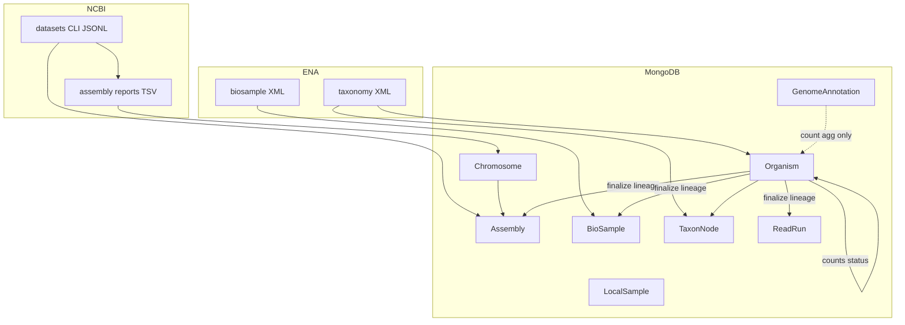

# Celery job: assemblies import (`jobs/assemblies.py`)

Reference for agents: end-to-end behavior, data flow, files, and MongoDB models.

## Entry points

| Symbol | Celery name | Role |
|--------|-------------|------|
| `import_assemblies_by_bioproject` | `assemblies_import` | NCBI `datasets` CLI: bioproject → JSONL → shared pipeline |
| `import_assemblies_from_accessions` | `accessions_import` | Same pipeline from explicit assembly accession list (batched 1000) |

---

## Environment and configuration

| Variable | Used for |
|----------|----------|
| `PROJECT_ACCESSION` | Default bioproject for `import_assemblies_by_bioproject` |
| `TMP_DIR` | JSONL, batch `.txt` inputs, biosample XML, taxonomy XML |

---

## Shared core: `_run_assembly_import_pipeline(jsonl_paths, context_label)`

All assembly ingest funnels through this function.

### Purpose

Ingest **NCBI Datasets** JSONL assembly records: ensure **organisms** and **taxon nodes**, optionally **biosamples**, **insert/update assemblies**, **chromosomes**, prune orphans, **finalize** catalog denorm (lineages + counts + statuses), **geolocate** new biosamples, **BlobToolKit** links, async **ToLID**.

### Why assemblies do not use `reload_prune_denorm_after_taxonomy_import`

That helper assumes **one** catalog model + **one** id field + a list of import ids (read runs or biosample accessions). The assembly job:

- Prunes **`Assembly`** by `accession` list and **`BioSample`** by fetched accession list **separately** (already done before finalize).
- Builds **`species_to_refresh`** from taxids on surviving saved assembly rows only (simplicity-first scope for this pipeline).

So it calls **`finalize_organism_catalog_for_taxids(species_to_refresh, copy_lineages=True)`** directly.

---

## Step-by-step (`_run_assembly_import_pipeline`)

1. **Empty JSONL paths** → return stub dict (`status: no_jsonl`, empty lists).
2. **Merge JSONL** — `jobs.support.assembly_jsonl.merge_assembly_jsonl_rows_from_paths`:
   - Reads each line as JSON; keys by `accession`.
   - Compares to `Assembly.objects().scalar("accession")`.
   - Returns `new_rows` (not in DB) and `assemblies_to_update` (existing accession → full record for metadata refresh).
3. **Taxids** — `collect_taxids_from_assembly_rows` from both structures (`organism.tax_id` in JSON).
4. **Biosample accessions** — `collect_sample_accessions_from_assembly_rows` (any row with a non-empty taxid); deduped list.
5. **Persist assemblies** — `persist_assembly_import_payload(new_rows, assemblies_to_update, taxids_with_organism=None)`:
   - Updates **metadata** on existing assemblies (if taxon allowed).
   - Parses new rows with `parsers.assembly.parse_assembly_from_ncbi_datasets` → **`Assembly`** insert (or per-doc save on bulk failure).
   - **`save_chromosomes_bulk_and_update_assemblies((accession, assembly_name), …)`**: for each new assembly, builds the usual NCBI genome FTP HTTPS URL to `*_assembly_report.txt` from accession + assembly name (spaces → `_`) and fetches it in **one** GET, streaming the body into the chromosome parser; if that fails (404, name mismatch, etc.), falls back to the prior directory-scrape + report GET. Persists **`Chromosome`** and **`Assembly.chromosomes`** via `aiohttp` and `clients.ncbi_assembly_http`.
6. **Fetch biosamples** — `resolve_biosamples_for_accessions` → **`BioSample`** inserts; list `newly_fetched_biosample_accessions`.
7. **Taxonomy** — `handle_full_taxonomy_from_taxids(all_taxids, TMP_DIR)` → **`saved_organism_taxids`**; `prune_organisms_missing_taxon_lineage(all_taxids)`.
8. **Prune assemblies** — `delete_rows_without_organism(Assembly, "accession", saved_assembly_accessions)` if any saved; optional inline Annotrieve with `skip_finalize=True`.
9. **Prune biosamples** — if biosamples fetched: `delete_rows_without_organism(BioSample, "accession", newly_fetched_biosample_accessions)`.
10. **Species refresh set** — union of taxids on surviving assemblies, taxids on fetched biosamples, and `saved_organism_taxids`.
11. **Finalize** — `bulk_copy_organism_lineages_to_catalog`, `update_organism_counts` / `update_taxon_node_counts`, `apply_goat_status_after_assembly_ingest` (when `GOAT_PROJECT_NAME` set), `run_enrich_followup_for_taxids`.
12. **Geolocation** — `update_geolocations(newly_fetched_biosample_accessions)` if non-empty.
13. **BlobToolKit** — for surviving new assemblies still missing `blobtoolkit_id`: `bulk_link_blobtoolkit_for_assembly_accessions`.
14. **Return** dict with accessions lists, organism taxids, blob stats, `status: ok`.

---

## Task: `import_assemblies_by_bioproject`

1. Resolve `project_accession`; path `{TMP_DIR}/{project_accession}.jsonl`.
2. **`clients.ncbi_client.query_datasets_to_file`** with argv roughly: `genome accession <PRJ> --assembly-source GenBank --as-json-lines`.
3. `_run_assembly_import_pipeline([jsonl_path], context_label=...)`.
4. Delete JSONL in `finally`.

---

## Task: `import_assemblies_from_accessions`

1. Dedupe/strip accessions; batch size **1000**.
2. Per batch: write `.txt` accession list, run `query_datasets_to_file` with `--inputfile` → `.jsonl`.
3. Merge all successful JSONL paths into one pipeline call.
4. Delete temp `.txt` / `.jsonl` in `finally`.

---

## Data flow diagram



---

## MongoDB models touched

| Model | Operation |
|-------|-----------|
| **Assembly** | insert, metadata update, `chromosomes` / `blobtoolkit_id` update, `taxon_lineage` set, orphan delete |
| **Chromosome** | delete by `metadata.assembly_accession`, insert new molecules |
| **BioSample** | insert (ENA), orphan delete, `taxon_lineage` update |
| **Organism** | insert (taxonomy); update counters, statuses, countries (geo); read |
| **TaxonNode** | insert (taxonomy); parent/children; rollup counts |
| **ReadRun** | `taxon_lineage` update only (by taxid) during finalize |
| **GenomeAnnotation** | aggregation-only for organism `genome_annotations_count` / taxon rollups |
| **LocalSample** | aggregation-only |
| **GoaTUpdateDate** | upsert when GoaT inference fires |

---

## File dependency tree (nested)

```
jobs/assemblies.py
├── clients/ncbi_client.py         → query_datasets_to_file (subprocess datasets CLI)
├── db/model.py                    → Assembly, BioSample, Organism
├── helpers/data.py                → create_batches (1000 accession batches)
├── helpers/job_paths.py
├── jobs/organisms.py              → fetch_tolid_prefixes_task
├── jobs/support/assembly_jsonl.py → bulk_link_blobtoolkit_for_assembly_accessions
│   ├── clients/genomehubs_client.py
│   └── db/model.py              → Assembly
├── jobs/support/assembly_jsonl.py
│   ├── parsers/assembly.py      → parse_assembly_from_ncbi_datasets
│   ├── clients/ncbi_assembly_http.py → report URLs, streaming lines
│   ├── aiohttp                  → concurrent report fetch
│   └── db/model.py              → Assembly, Chromosome
├── jobs/support/biosample_bulk.py → (same tree as reads doc)
├── jobs/support/geolocation_batch.py
├── jobs/support/organism_catalog_taxonomy.py → handle_full_taxonomy_from_taxids
├── jobs/support/organism_catalog_guard.py → delete_rows_without_organism
└── jobs/support/organism_catalog_finalize.py → finalize_organism_catalog_for_taxids
    └── (same denorm subtree as reads doc)
```

---

## Failure and edge cases

- No usable JSONL rows → `RuntimeError`.
- `datasets` returns no file → `RuntimeError` (bioproject) or batch skipped (accession import) with possible `no_output` return.
- Chromosome fetch failure per assembly → logged; existing chromosomes may be left unchanged for that accession.
- Bulk assembly insert failure → fallback per-document save/update.
