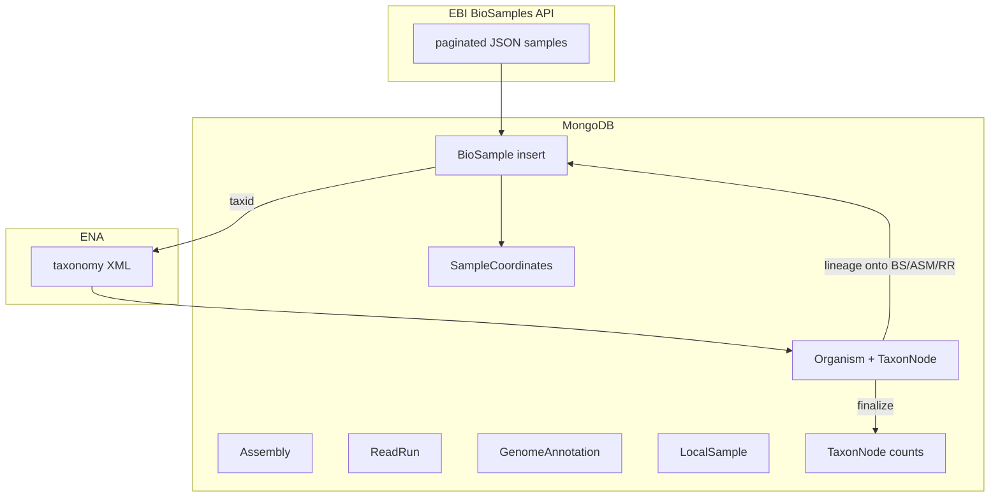

# Celery job: biosamples import (`jobs/biosamples.py`)

Reference for agents: end-to-end behavior, data flow, files, and MongoDB models.

## Entry point

| Symbol | Celery name | Role |
|--------|-------------|------|
| `import_biosamples_from_project_names` | `biosamples_import` | Paginate EBI BioSamples API by project name filter; insert new samples; taxonomy + catalog sync + geo |

---

## Environment and configuration

| Variable | Default | Role |
|----------|---------|------|
| `PROJECTS` | **required** | Comma-separated **project names** (not accessions) for BioSamples API filter |
| `TMP_DIR` | `/tmp` | Taxonomy XML fetch path |
| `BIOSAMPLE_IMPORT_ACCESSION_BATCH` | `5000` | Mongo `$in` chunk size for existence / taxid queries |

---

## Purpose

Discover samples tagged with `project name` in BioSamples, **insert only new** `BioSample` documents (skip duplicates already in DB), then ensure **taxonomy**, **prune** samples without organisms, **sync** lineages and denormalized counts with **`biosample_import` GoaT merge context**, **ToLID** async task, and **geolocation** for all saved accessions in this run.

---

## Step-by-step

1. **Validate** `PROJECTS` env non-empty → split/trim → list `project_names`.

2. **Stats dict** — projects count, pages, inserted, parse_skipped, fetch_errors, orphan_biosamples_removed.

3. **Per project name**
   - URL-encode name (`urllib.parse.quote`).
   - Start URL: `https://www.ebi.ac.uk/biosamples/samples?size=200&filter=attr%3Aproject%20name%3A{encoded}`.
   - **Pagination loop** while `url` set:
     - `clients.ebi_client.fetch_biosamples_from_ebi(url)` → `(list of raw JSON samples, next_url)`.
     - On exception: log, increment `fetch_errors`, break project loop.
     - For each raw sample: `_parse_biosample_safe` → `parsers.biosample.parse_biosample_from_ebi_data` or skip with `parse_skipped`.
     - **Dedup against DB**: `_existing_accessions_batch` → `BioSample.objects(accession__in=batch).scalar("accession")` in chunks.
     - **Insert** `new_biosamples` via `BioSample.objects.insert`; on failure, per-doc `save()` with duplicate handling (`NotUniqueError`, `ValidationError`).
     - Append **saved** accessions to `saved_accessions` (master list across projects).
     - Advance page / `url = new_url`.

4. **Post-import** (only if `saved_accessions` non-empty)

   a. **`_scalar_taxids_for_accessions(saved_accessions)`** — batched `BioSample.objects(...).scalar("taxid")`; filter falsy.

   b. **`handle_full_taxonomy_from_taxids(biosample_taxids, TMP_DIR)`** → **`saved_organism_taxids`** (new organism inserts only).

   c. **`reload_prune_denorm_after_taxonomy_import(BioSample, "accession", saved_accessions, saved_organism_taxids, merge_context="biosample_import")`**  
      Same machinery as reads job (see `docs/celery-jobs/reads-import.md` § catalog sync), except:
      - **No ReadRun** model → **no** `backfill_readrun_taxon_lineage_from_organisms`.
      - **`merge_context="biosample_import"`** → `derive_organism_denorm` avoids downgrading GoaT `DATA_GENERATION` / `IN_ASSEMBLY` when inference would be weaker (e.g. more biosamples only).

   d. **`stats["orphan_biosamples_removed"] +=` returned** delete count.

   e. **`fetch_tolid_prefixes_task.delay(saved_organism_taxids)`** if any.

   f. **`update_geolocations(saved_accessions)`** — same as reads: `SampleCoordinates`, organism countries, etc.

5. **Return** `stats` dict (or early return stats if no new samples).

---

## Data flow diagram



---

## MongoDB models touched

| Model | Operation |
|-------|-----------|
| **BioSample** | insert; read for existing/taxid; **delete** orphans (no organism); **update** `taxon_lineage` from organism |
| **Organism** | insert (taxonomy); update counters, `insdc_status`, `goat_status` (with `biosample_import` rules), countries |
| **TaxonNode** | insert (taxonomy); graph edges; rollup counts |
| **Assembly**, **ReadRun** | **update** `taxon_lineage` by taxid during `bulk_copy_organism_lineages_to_catalog` |
| **GenomeAnnotation**, **LocalSample** | aggregation-only for organism counts / taxon rollups |
| **GoaTUpdateDate** | upsert when GoaT inference updates |
| **SampleCoordinates** | upsert via geolocation |

---

## File dependency tree (nested)

```
jobs/biosamples.py
├── clients/ebi_client.py          → fetch_biosamples_from_ebi (pagination)
├── db/model.py                    → BioSample
├── mongoengine.errors             → NotUniqueError, ValidationError
├── helpers/data.py                → create_batches
├── jobs/organisms.py              → fetch_tolid_prefixes_task
├── jobs/support/geolocation_batch.py → update_geolocations
├── jobs/support/organism_catalog_sync.py → handle_full_taxonomy_from_taxids, reload_prune_denorm_after_taxonomy_import(..., merge_context="biosample_import")
│   ├── readrun_ena_tsv.py       → backfill only if model is ReadRun (not used here)
│   └── organism_denorm_pure.py  → MergeContext "biosample_import" behavior
└── parsers/biosample.py           → parse_biosample_from_ebi_data
```

---

## Parser vs bulk fetch parser

- **This job**: JSON samples from BioSamples API → `parse_biosample_from_ebi_data`.
- **Reads/assemblies biosample path**: ENA portal **XML** → `parse_biosample_from_ena_xml_element` inside `biosample_bulk.parse_biosamples_from_xml`.

Same domain model **`BioSample`**; different source shapes.

---

## Failure and edge cases

- Missing `PROJECTS` → `ValueError` before any I/O.
- Per-page fetch failure → project aborted; other projects still processed if loop continues (current code breaks inner loop only).
- Post-import exception → logged, re-raised; samples already inserted remain (no transaction).

---

## Comparison to reads job

| Aspect | Biosamples job | Reads job |
|--------|----------------|-----------|
| Primary insert | `BioSample` | `ReadRun` |
| Catalog prune model | `BioSample` / `accession` | `ReadRun` / `run_accession` |
| ReadRun backfill | No | Yes |
| `merge_context` | `"biosample_import"` | `default` (None) |
| Upstream API | BioSamples web API | ENA filereport TSV |
