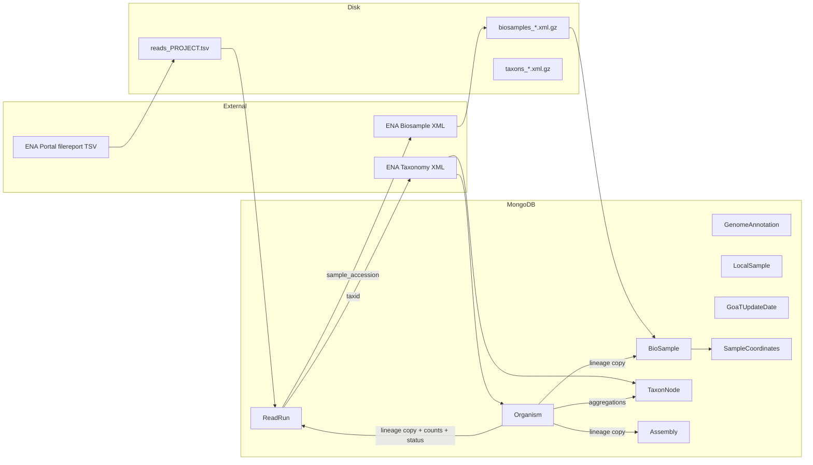

# Celery job: reads import (`jobs/reads.py`)

Reference for agents: end-to-end behavior, data flow, files, and MongoDB models.

## Entry points

| Symbol | Celery name | Role |
|--------|-------------|------|
| `get_reads_from_bioproject_accession` | `reads_import` | Main import from ENA bioproject filereport |
| `clean_up_deprecated_models` | `clean_up_old_data` | Drops legacy `Experiment` and `Read` collections (not `ReadRun`) |

---

## Environment and configuration

| Variable | Used for |
|----------|----------|
| `PROJECT_ACCESSION` | Default bioproject accession if task argument omitted |
| `TMP_DIR` | TSV download path (default `/tmp`) |
| `BIOSAMPLE_IMPORT_ACCESSION_BATCH` | Inherited by `geolocation_batch.update_geolocations` (default 5000) via `geolocation_batch` |

---

## Task: `get_reads_from_bioproject_accession`

### Purpose

Stream ENA **read_run** data for a bioproject into a TSV, insert/update **`ReadRun`** rows, pull linked **biosamples** from ENA, ensure **taxonomy** (`Organism`, `TaxonNode`), **align lineages and denormalized counts** across the catalog, then **geolocate** biosamples. Optionally queue **ToLID prefix** fetch for newly inserted organisms.

### Why this order

1. **Read runs first** — core fact: which runs exist and their `taxid` / `sample_accession`.
2. **Biosamples** — many runs share one sample; fetch once per accession.
3. **Taxonomy** — `Organism` must exist for a species before orphan pruning makes sense.
4. **Catalog sync** — copies `Organism.taxon_lineage` onto `ReadRun`/`BioSample`/`Assembly`, updates counts on `Organism` and `TaxonNode`, derives `insdc_status` / `goat_status`.
5. **Geolocation** — uses `BioSample.metadata` and organism lineages after lineages are consistent.

---

## Step-by-step (numbered)

1. **Resolve** `project_accession` from argument or `PROJECT_ACCESSION`; validate non-empty.
2. **Path** `output_file_path = {TMP_DIR}/reads_{project_accession}.tsv`; `ensure_parent_dir`.
3. **HTTP (ENA)** — `clients.ebi_client.fetch_experiments_by_bioproject_streaming(project_accession, output_file_path)` writes TSV to disk. On failure → `RuntimeError`.
4. **Parse TSV** — `jobs.support.readrun_ena_tsv.ingest_readruns_from_ena_tsv(output_file_path)`:
   - Reads tab-separated filereport with `csv.DictReader`.
   - Each row → `parsers.read.parse_read_from_ena_portal` → **`ReadRun`** instance (`run_accession`, `taxid`, `experiment_accession`, `sample_accession`, `scientific_name`, `metadata` = full row).
   - **New** runs: batched existence check + `insert_readrun_batch` → `ReadRun.objects.insert` (existing runs are skipped; no bulk metadata refresh in this path).
   - Returns `(new_read_accessions: List[str], ReadRunTsvIngestStats)`.
5. **Collect sample accessions** — `jobs.support.read_batch_queries.biosample_related_maps_from_run_accessions`: chunked `ReadRun` lookups (default 5000 `run_accession`s per query) build `related_id_by_biosample` and `biosample_accessions_ordered` with **first biosample accession per sample** when stepping through `new_read_accessions` in list order (bounded `$in` size for large bioprojects).
6. **Fetch biosamples** — `jobs.support.biosample_ingest.resolve_biosamples_for_accessions(...)` (ENA / NCBI tiers; see `biosample_ingest.py`).
7. **ReadRun ↔ BioSample sync** — `apply_readrun_taxonomy_from_biosamples_for_accessions(new_read_accessions)` (taxid / sample fields from resolved biosamples where applicable).
8. **Taxonomy** — `jobs.support.read_batch_queries.unique_taxids_for_taxonomy_from_run_accessions` (batched `taxid` scalars) → **distinct** non-pending taxids (sorted) → `jobs.support.catalog_taxonomy_bootstrap.handle_full_taxonomy_from_taxids(..., TMP_DIR)`:
   - Inserts missing **`Organism`** + **`TaxonNode`** stubs from ENA taxonomy XML.
   - Returns **`saved_organism_taxids`** (taxids where a **new** `Organism` was inserted this call — not all touched taxids).
   - `prune_organisms_missing_taxon_lineage` on the **same unique** taxid list (avoids redundant work when many runs share a species).
9. **Prune orphan runs** — `delete_rows_without_organism(ReadRun, "run_accession", new_read_accessions)` when the batch is non-empty.
10. **Still-present runs** — `jobs.support.read_batch_queries.run_accessions_still_in_database` (batched queries), then **Scientific name backfill** — `backfill_readrun_scientific_name_from_organisms(run_accessions_still_in_db)` for runs still in DB after prune.
11. **Finalize** — build `species_to_refresh` (taxids from surviving runs ∪ `saved_organism_taxids`); then `bulk_copy_organism_lineages_to_catalog`, `update_organism_counts` / `update_taxon_node_counts`, `apply_goat_status_after_reads_ingest` when `GOAT_PROJECT_NAME` is set, and `run_enrich_followup_for_taxids`.
12. **Geolocation** — `update_geolocations(...)` on biosample accessions that were actually saved.
13. **Cleanup** — `safe_remove_file(output_file_path)` in `finally`.
14. **Return** dict with stats + `status: ok`.

---

## Data flow diagram



---

## MongoDB models touched

| Model | Operation | When / why |
|-------|-----------|------------|
| **ReadRun** | insert, metadata update, delete (orphans); scientific-name backfill | Core import; prune if no organism |
| **BioSample** | insert (via bulk handler) | Samples linked to new runs |
| **Organism** | insert (taxonomy); read; **update** counters, `insdc_status`, `goat_status`; countries via geolocation | Taxonomy + `finalize_organism_catalog_for_taxids` + geo |
| **TaxonNode** | insert (taxonomy); **update** parent/children, rollup counts | `bulk_copy_organism_lineages_to_catalog` + taxon count phase |
| **Assembly** | **update** `taxon_lineage` only (by matching `taxid`) | Lineage propagation from organism |
| **GenomeAnnotation** | read-only in aggregations | `genome_annotations_count` on organism / taxon rollups |
| **LocalSample** | read-only in aggregations | Same |
| **GoaTUpdateDate** | upsert | When GoaT inference updates status |
| **SampleCoordinates** | upsert (via geolocation) | From biosample coords |
| **Experiment**, **Read** | **not** used by `reads_import`; dropped only by `clean_up_deprecated_models` | Legacy cleanup task |

---

## File dependency tree (nested)

```
jobs/reads.py
├── clients/ebi_client.py          → fetch_experiments_by_bioproject_streaming
├── db/model.py                    → Experiment, Read, ReadRun
├── helpers/job_paths.py           → ensure_parent_dir, safe_remove_file
├── jobs/organisms.py              → fetch_tolid_prefixes_task
├── jobs/support/biosample_ingest.py → resolve_biosamples_for_accessions
├── jobs/support/catalog_taxonomy_bootstrap.py → handle_full_taxonomy_from_taxids
├── jobs/support/catalog_denorm_finalize.py → bulk_copy_organism_lineages_to_catalog
├── jobs/support/stats.py → update_organism_counts, update_taxon_node_counts
├── jobs/support/goat_status.py → apply_goat_status_after_reads_ingest
├── jobs/support/organism_enrich.py → run_enrich_followup_for_taxids
├── jobs/support/geolocation_batch.py → update_geolocations
│   ├── db/model.py              → BioSample, Organism, SampleCoordinates
│   ├── shapely                  → Point, polygon country lookup
│   └── countries.json           → polygon data (server-relative path)
└── jobs/support/readrun_ena_tsv.py → ingest_readruns_from_ena_tsv
    ├── parsers/read.py          → parse_read_from_ena_portal
    └── db/model.py              → ReadRun
```

---

## Policy notes (reads-specific)

- **`merge_context`**: not passed → **`default`** GoaT merge rules in `derive_organism_denorm` (unlike biosample job’s `biosample_import`).
- **`saved_organism_taxids`** is a **subset** of species touched; `reload_prune_denorm_after_taxonomy_import` unions **batch ReadRun taxids** with it so lineages refresh for species whose organism already existed.

---

## Failure and edge cases

- Empty filereport → `RuntimeError` before DB writes.
- TSV unreadable → `RuntimeError` wrapping `OSError`.
- Parse errors per row → logged, row skipped; stats `rows_skipped`.
- Biosample fetch may silently skip failed XML batches (see `biosample_bulk` logs).
- Post-import block: any exception → logged and re-raised after partial work; TSV still removed in `finally`.
