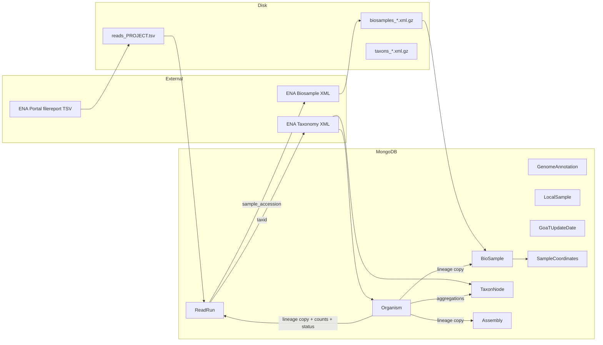

# Celery job: reads import (`jobs/reads.py`)

Reference for agents: end-to-end behavior, data flow, files, and MongoDB models.

## Entry points

| Symbol | Celery name | Role |
|--------|-------------|------|
| `get_reads_from_bioproject_accession` | `reads_import` | Main import from ENA bioproject filereport |
| `clean_up_deprecated_models` | `clean_up_old_data` | Drops legacy `Experiment` and `Read` collections (not `ReadRun`) |

---

## Environment and configuration

| Variable | Used for |
|----------|----------|
| `PROJECT_ACCESSION` | Default bioproject accession if task argument omitted |
| `TMP_DIR` | TSV download path (default `/tmp`) |
| `BIOSAMPLE_IMPORT_ACCESSION_BATCH` | Inherited by `geolocation_batch.update_geolocations` (default 5000) via `geolocation_batch` |

---

## Task: `get_reads_from_bioproject_accession`

### Purpose

Stream ENA **read_run** data for a bioproject into a TSV, insert/update **`ReadRun`** rows, pull linked **biosamples** from ENA, ensure **taxonomy** (`Organism`, `TaxonNode`), **align lineages and denormalized counts** across the catalog, then **geolocate** biosamples. Optionally queue **ToLID prefix** fetch for newly inserted organisms.

### Why this order

1. **Read runs first** — core fact: which runs exist and their `taxid` / `sample_accession`.
2. **Biosamples** — many runs share one sample; fetch once per accession.
3. **Taxonomy** — `Organism` must exist for a species before orphan pruning makes sense.
4. **Catalog sync** — copies `Organism.taxon_lineage` onto `ReadRun`/`BioSample`/`Assembly`, updates counts on `Organism` and `TaxonNode`, derives `insdc_status` / `goat_status`.
5. **Geolocation** — uses `BioSample.metadata` and organism lineages after lineages are consistent.

---

## Step-by-step (numbered)

1. **Resolve** `project_accession` from argument or `PROJECT_ACCESSION`; validate non-empty.
2. **Path** `output_file_path = {TMP_DIR}/reads_{project_accession}.tsv`; `ensure_parent_dir`.
3. **HTTP (ENA)** — `clients.ebi_client.fetch_experiments_by_bioproject_streaming(project_accession, output_file_path)` writes TSV to disk. On failure → `RuntimeError`.
4. **Parse TSV** — `jobs.support.readrun_ena_tsv.ingest_readruns_from_ena_tsv(output_file_path)`:
   - Reads tab-separated filereport with `csv.DictReader`.
   - Each row → `parsers.read.parse_read_from_ena_portal` → **`ReadRun`** instance (`run_accession`, `taxid`, `experiment_accession`, `sample_accession`, `scientific_name`, `metadata` = full row).
   - **Existing** `run_accession`: accumulates `metadata` updates, flushed in batches (`flush_readrun_metadata_updates`).
   - **New** runs: batched `insert_readrun_batch` → `ReadRun.objects.insert`.
   - Returns `(new_read_accessions: List[str], ReadRunTsvIngestStats)`.
5. **Collect sample accessions** — `ReadRun.objects(run_accession__in=new_read_accessions).scalar("sample_accession")` (may include duplicates/None; downstream dedupes).
6. **Fetch biosamples** — `jobs.support.biosample_bulk.handle_biosamples_from_accessions(biosamples_to_fetch, TMP_DIR)`:
   - Batches accessions (5000); skips already in `BioSample`.
   - `ebi_client.get_xml_from_ena_browser` → gzipped XML → `parse_biosamples_from_xml` → `parsers.biosample` → **`BioSample.objects.insert`**.
   - Returns list of **saved** biosample accessions.
7. **Taxonomy** — `ReadRun.objects(run_accession__in=new_read_accessions).scalar("taxid")` → `jobs.support.organism_catalog_sync.handle_full_taxonomy_from_taxids(...)`:
   - Inserts missing **`Organism`** + **`TaxonNode`** stubs from ENA taxonomy XML.
   - Insert-only bootstrap: no finalize and no ToLID call inside this helper.
   - Returns **`saved_organism_taxids`** (taxids where a **new** `Organism` was inserted this call — not all touched taxids).
8. **Catalog sync + prune** — `jobs.support.organism_catalog_sync.reload_prune_denorm_after_taxonomy_import(ReadRun, "run_accession", new_read_accessions or None, saved_organism_taxids)` (default `merge_context`):
   - `taxids_on_catalog_documents` for batch `taxid` set.
   - `bulk_copy_organism_lineages_to_catalog` for union(batch taxids, saved organism taxids).
   - **`backfill_readrun_taxon_lineage_from_organisms(new_read_accessions)`** — per-run `UpdateOne` by `run_accession` (handles BSON `taxid` quirks).
   - If `new_read_accessions` empty → returns `0` early (no prune).
   - Else `delete_rows_without_organism(ReadRun, ...)` — removes runs in batch whose `taxid` has no `Organism`.
   - `finalize_organism_catalog_for_taxids(sync_taxids, copy_lineages=False)` — counts, TaxonNode roll-ups, statuses (lineage already copied).
   - **Extra** `bulk_update_taxon_node_counts_for_keys` for organisms that had batch taxids but may have lost all runs (ancestor counts).
9. **ToLID** — if `saved_organism_taxids`: `jobs.organisms.fetch_tolid_prefixes_task.delay(...)`.
10. **Geolocation** — `jobs.support.geolocation_batch.update_geolocations(saved_biosample_accessions)` → `SampleCoordinates`, `Organism.countries`, etc.
11. **Cleanup** — `safe_remove_file(output_file_path)` in `finally`.
12. **Return** dict with stats + `status: ok`.

---

## Data flow diagram



---

## MongoDB models touched

| Model | Operation | When / why |
|-------|-----------|------------|
| **ReadRun** | insert, metadata update, delete (orphans), bulk lineage `UpdateOne` | Core import; prune if no organism |
| **BioSample** | insert (via bulk handler) | Samples linked to new runs |
| **Organism** | insert (taxonomy); read; **update** counters, `insdc_status`, `goat_status`; countries via geolocation | Taxonomy + `finalize_organism_catalog_for_taxids` + geo |
| **TaxonNode** | insert (taxonomy); **update** parent/children, rollup counts | `bulk_copy_organism_lineages_to_catalog` + taxon count phase |
| **Assembly** | **update** `taxon_lineage` only (by matching `taxid`) | Lineage propagation from organism |
| **GenomeAnnotation** | read-only in aggregations | `genome_annotations_count` on organism / taxon rollups |
| **LocalSample** | read-only in aggregations | Same |
| **GoaTUpdateDate** | upsert | When GoaT inference updates status |
| **SampleCoordinates** | upsert (via geolocation) | From biosample coords |
| **Experiment**, **Read** | **not** used by `reads_import`; dropped only by `clean_up_deprecated_models` | Legacy cleanup task |

---

## File dependency tree (nested)

```
jobs/reads.py
├── clients/ebi_client.py          → fetch_experiments_by_bioproject_streaming
├── db/model.py                    → Experiment, Read, ReadRun
├── helpers/job_paths.py           → ensure_parent_dir, safe_remove_file
├── jobs/organisms.py              → fetch_tolid_prefixes_task
├── jobs/support/biosample_bulk.py → handle_biosamples_from_accessions
│   ├── clients/ebi_client.py    → get_xml_from_ena_browser
│   ├── db/model.py              → BioSample
│   ├── parsers/biosample.py     → parse_biosample_from_ena_xml_element (XML path)
│   └── lxml.etree               → streaming SAMPLE parse
├── jobs/support/organism_catalog_sync.py → handle_full_taxonomy_from_taxids, reload_prune_denorm_after_taxonomy_import, …
│   ├── db/model.py              → Assembly, BioSample, GenomeAnnotation, GoaTUpdateDate, LocalSample, Organism, ReadRun, TaxonNode
│   ├── helpers/organism_denorm_pure.py → derive_organism_denorm (status policy)
│   ├── db/constants.py          → GOAT_PROJECT_NAME
│   └── jobs/support/readrun_ena_tsv.py → backfill_readrun_taxon_lineage_from_organisms
├── jobs/support/geolocation_batch.py → update_geolocations
│   ├── db/model.py              → BioSample, Organism, SampleCoordinates
│   ├── shapely                  → Point, polygon country lookup
│   └── countries.json           → polygon data (server-relative path)
└── jobs/support/readrun_ena_tsv.py → ingest_readruns_from_ena_tsv
    ├── parsers/read.py          → parse_read_from_ena_portal
    └── db/model.py              → ReadRun
```

---

## Policy notes (reads-specific)

- **`merge_context`**: not passed → **`default`** GoaT merge rules in `derive_organism_denorm` (unlike biosample job’s `biosample_import`).
- **`saved_organism_taxids`** is a **subset** of species touched; `reload_prune_denorm_after_taxonomy_import` unions **batch ReadRun taxids** with it so lineages refresh for species whose organism already existed.

---

## Failure and edge cases

- Empty filereport → `RuntimeError` before DB writes.
- TSV unreadable → `RuntimeError` wrapping `OSError`.
- Parse errors per row → logged, row skipped; stats `rows_skipped`.
- Biosample fetch may silently skip failed XML batches (see `biosample_bulk` logs).
- Post-import block: any exception → logged and re-raised after partial work; TSV still removed in `finally`.
