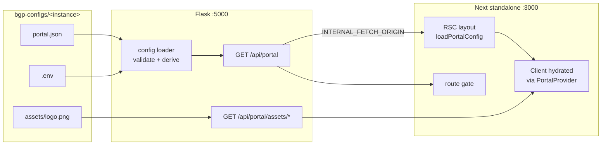

# Front-end configuration centralization — phased plan

Status: Phases 0–5 and 7 (mechanical) implemented and verified; Phase 6 resolved as Option A;
CBP production migration drafted (staged, not deployed) modeled on `biogenome-portal-cbp-demo`
at root basePath. Shared-compose-fragment remains deferred. How-config-works reference:
`docs/portal-configuration.md`. Nothing below is committed yet — every change exists only as
uncommitted working-tree diffs in both repos.
Scope: `biogenome-portal/front`, `biogenome-portal/server`, `bgp-configs`

Goal: collapse the four parallel configuration channels that currently feed the Next.js
front-end into a single source of truth per instance, and make the published front-end
image as close to instance-agnostic as possible — ideally one image tag for all portals,
with `basePath` as the only remaining deployment-time knob.

---

## 1. Baseline (pre-refactor)

> **Historical snapshot.** Sections 1.1–1.5 describe the system *before* Phases 0–7.
> They are kept so the problem statement (§2) and phase diffs stay readable. For the
> **current** working-tree architecture (backend `GET /api/portal`, Option A images,
> CBP draft at root), see [`portal-configuration.md`](./portal-configuration.md).
> Phase status markers in §4 are authoritative for what has shipped in the working tree.

### 1.1 Repositories and responsibilities

| Repo | Contains |
| --- | --- |
| `biogenome-portal` | `front/` (Next.js 16, `output: 'standalone'`), `server/` (Flask + uWSGI on `:5000`), Celery workers, reverse-proxy templates |
| `bgp-configs` | One folder per instance: `portal.json`, `.env`, `docker-compose.yml`, logo assets, `mongo-init.sh`, `celery_beat_schedule.json`; plus `portal.schema.json` and `scripts/prep-branding.sh` |

Eight instances exist today: `biogenaria`, `cbp`, `cbp-demo`, `ebp`, `erga`,
`lichenoteca`, `mediterranean`, `mexico`.

### 1.2 The build pipeline

`bgp-configs/.github/workflows/build-next-front-ecr.yml` drives everything:

1. Checks out `bgp-configs` at the workspace root and `guigolab/biogenome-portal` as a sibling.
2. Runs `scripts/prep-branding.sh <instance-dir> <portal-root>`, which copies
   `portal.json` → `front/branding/portal.config.json` and every `*.png|svg|webp|jpg|geojson`
   → `front/branding/`.
3. Computes `API_BASE` as `${BASE_PATH}/api` when `portal_api_base` input is empty.
4. `docker build` with build args `NEXT_PUBLIC_BASE_PATH`, `NEXT_PUBLIC_CMS`,
   `PORTAL_API_BASE`, `PORTAL_ROOT_TAXID`.
5. Pushes `…/biogenome_registry:portal_next_<instance>`.

Inside `front/Dockerfile`, the builder stage declares nine build args
(`NEXT_PUBLIC_BASE_PATH`, `PORTAL_API_BASE`, `PORTAL_ROOT_TAXID`, `NEXT_PUBLIC_CMS`,
`PORTAL_GOAT`, `PORTAL_MAP`, `NEXT_PUBLIC_SHOW_COUNTRIES`, `NEXT_PUBLIC_MATOMO_URL`,
`NEXT_PUBLIC_MATOMO_SITE_ID`), then runs `node scripts/bake-portal.mjs` followed by
`npm run build` (whose `prebuild` bakes a second time).

`front/scripts/bake-portal.mjs` merges, last-wins:

1. `lib/portal/defaultPortal.json`
2. `branding/portal.config.json`
3. scalar env overrides: `PORTAL_API_BASE`, `PORTAL_ROOT_TAXID`, `NEXT_PUBLIC_CMS`,
   `PORTAL_GOAT`, `PORTAL_MAP`

and writes `public/portal.json`, then copies every non-config file from `branding/` into `public/`.

### 1.3 The read paths at runtime

| Consumer | Source | Notes |
| --- | --- | --- |
| RSC / SSR | `loadPortalConfigFromDisk()` reads `process.cwd()/public/portal.json` | `portalServer.ts:8`; wrapped in React `cache()`, so it re-reads **once per request** |
| Client | `Providers initialPortal={portal}` from `app/layout.tsx:56` | Falls back to `fetchPortalConfig()` → `GET {basePath}/portal.json` when no initial value |
| Middleware (Edge) | **Build-inlined env only** | `lib/cms/middleware-portal.ts:22-27` reads `NEXT_PUBLIC_CMS` and `PORTAL_API_BASE`; explicitly does not read `portal.json` |
| API base | `getApiBase()` in `lib/api/taxon.ts:14` | `NEXT_PUBLIC_API_BASE` → `general.apiBase` → `origin + basePath + /api` |
| Server-side fetch | `resolveApiBaseForFetch()` in `apiRuntime.ts:35` | Turns the path-only base into an absolute URL using `INTERNAL_FETCH_ORIGIN`, stripping `NEXT_PUBLIC_BASE_PATH` |

The backend does **not** participate: there is no `GET /api/portal` or `/api/config`
endpoint anywhere in `server/`, and no Python code reads `configs/portal.json`. The
`bgp-configs/README.md` claim that compose binds `./portal.json:/server/configs/portal.json`
is stale documentation.

### 1.4 Deployment topology

Seven instances run the Next image behind Traefik on `genome.crg.{es,cat,eu}` at a subpath,
with split routers, for example (`biogenome-portal-mexico/docker-compose.yml:43-77`):

- `PathPrefix('/mexico-bgp/api')`, priority 100, `stripprefix=/mexico-bgp` → Flask `:5000`
- `PathPrefix('/mexico-bgp')`, priority 10 → Next `:3000`
- `INTERNAL_FETCH_ORIGIN=http://mexbgp_server:5000` on the Next container

CBP production was the exception at plan start: the **deployed** stack still runs the
legacy `cbp_front` nginx image at the host root of `dades.biogenoma.cat`. The
**working-tree** `biogenome-portal-cbp/docker-compose.yml` now drafts the Next migration
(`cbp_next` / `portal_next_cbp`, Phase 3/4 mounts, Traefik `PathPrefix('/api')` with no
stripprefix) — staged for review, **not deployed**. Until cutover, two front-end stacks
remain in live production. See Phase 7 / Open Decision 5.

### 1.5 What actually differs between instances

This is the crux. Comparing all eight `portal.json` and `.env` files:

| Dimension | Varies? | Observation |
| --- | --- | --- |
| `general.apiBase` | Nominally yes | Always exactly `${BASE_PATH}/api`. Never independent. |
| `general.rootTaxid` | **No** | `"2759"` in all eight, and every `.env` has `ROOT_NODE=2759` — duplicated across the boundary. |
| `basePath` | Yes | `/biogenaria`, `/bgp`, `/cbp-demo`, `/ebp`, `/erga`, `/lichenoteca`, `/mediterranean`, `/mexico-bgp` |
| Branding (title, description, theme, footer, languages, logo) | Yes | The real payload. |
| `cms` / `goat` | Yes | `true` only for `cbp` and `cbp-demo`. `goat` also implied by backend `GOAT_PROJECT_NAME`. |
| `models` overrides | Rarely | Only `cbp` (`local_samples` label/columns) and `lichenoteca` (full catalog definition). |
| Logo file | 3 of 8 | `CBPLogo.png`, `EBP-Logo.png`, `ERGA-Logo.webp`. |

So the entire per-instance delta for the front-end reduces to **basePath + one JSON document
+ at most one image file**. Two of the three build args that exist today are mechanically
derivable from data the system already has.

---

## 2. Problems to solve

**P1 — Four channels for one concern.** The same flag can be set in `defaultPortal.json`,
`branding/portal.config.json`, a Docker build arg, and (for CMS) a separate `NEXT_PUBLIC_*`
inline. Nothing reconciles them.

**P2 — Derived values are hand-configured.** `apiBase` and `rootTaxid` are each written in
three places (portal.json, workflow input, backend `.env`) with no cross-check.

**P3 — Branding is baked, so a copy edit is a rebuild.** Changing a footer tagline requires
a workflow dispatch, an ECR push, and a container restart.

**P4 — The middleware reads a different source than the UI.** `NEXT_PUBLIC_CMS` gates
`/admin` and `/login`; `general.cms` gates the nav links and the login page. They are set by
the same build in CI, but drift silently in any other path.

**P5 — Two schema copies have drifted.** `bgp-configs/portal.schema.json` (270 lines) and
`front/portal.schema.json` (294 lines) are not identical, and neither is enforced anywhere.

**P6 — Dead and undocumented knobs.** `NEXT_PUBLIC_SHOW_COUNTRIES` is env-only and absent
from the schema; `CONFIG_CACHE_SECONDS` and `PORTAL_JSON_HOST` appear in env files with no
reader. (`PORTAL_INSDC_STATUS` / `general.insdcStatus` and the `hero-map.geojson` branding
copy were removed — see Phase 0.)

**P7 — Instance branding is committed to the code repo.** `front/public/portal.json` is
git-tracked and currently holds a real instance's configuration.

**P8 — The workflow has five hand-typed inputs** that must agree with `portal.json`, the
compose labels, and the backend `.env`. Nothing validates the agreement; the workflow header
comment is the only guard rail.

**P9 — Two production front-end stacks** (Next + legacy nginx for CBP).

**P10 — The backend cannot be the authority** because it exposes no config endpoint.

---

## 3. Target architecture

One source of truth per instance: `bgp-configs/<instance>/portal.json`, validated against a
single schema, mounted (not baked) at runtime, served by Flask, and consumed by Next during
SSR. Everything else is either derived or removed.

Front-end container contract after the refactor:

| Variable | Type | Purpose |
| --- | --- | --- |
| `NEXT_PUBLIC_BASE_PATH` | build arg (see Phase 6) | Next `basePath` / asset prefix |
| `INTERNAL_FETCH_ORIGIN` | runtime env | Absolute origin of Flask on the Docker network |

Nothing else. No branding directory, no bake step, no per-instance feature flags.

---

## 4. Phased plan

Each phase is independently shippable and independently revertible. Phases 0–3 deliver most
of the operational benefit; phases 4–6 deliver the agnostic image.

### Phase 0 — Freeze the contract and remove dead weight

**Status: done.** `rg 'PORTAL_INSDC_STATUS|insdcStatus|hero-map|CONFIG_CACHE_SECONDS|PORTAL_JSON_HOST'`
returns zero hits outside this document and the unrelated `Organism.insdc_status` **data** field /
`INSDC_STATUS_VALUES` helpers in `front/lib/organismStatusLabels.ts`; `front/public/portal.json`
and `front/public/CBPLogo.png` (plus unused starter `public/` placeholders) are deleted and
staged; both portal branding paths are `.gitignore`d.

**Goal:** shrink the surface before changing it, so later phases have less to carry.

Changes:
- **Done — `general.insdcStatus` removed.** The flag had no consumer in `front/`. Deleted the
  `PORTAL_INSDC_STATUS` override from `bake-portal.mjs`, the `insdcStatus` property from
  `bgp-configs/portal.schema.json`, and the key from the two instances that set it
  (`ebp`, `lichenoteca`). The `Organism.insdc_status` **data** field is unrelated and untouched.
- **Done — geojson branding copy removed.** Dropped `*.geojson` from the `prep-branding.sh`
  copy glob and cleared the `hero-map.geojson` references from the bake script header,
  `.gitignore`, `build-and-push-ecr.yml`, and `docker-compose-DEV.yml`. Also `git rm`'d the
  orphaned `bgp-configs/biogenome-portal-mediterranean/coorinates.geojson` (never referenced
  by any `portal.json` or loaded by the front-end).
- **Done — `CONFIG_CACHE_SECONDS` and `PORTAL_JSON_HOST` removed** from env files and compose
  (zero hits outside this document).
- **Done — untrack `front/public/portal.json` and `front/public/CBPLogo.png`.** Both deleted
  and staged in the working tree; both paths are in `.gitignore`. Keep
  `lib/portal/defaultPortal.json` as the only
  committed config.
- **Done — `bgp-configs/README.md` updated** for Phase 4 backend authority
  (`./portal.json:/server/configs/portal.json:ro` → `GET /api/portal`).

Acceptance: `rg 'PORTAL_INSDC_STATUS|insdcStatus|hero-map|CONFIG_CACHE_SECONDS|PORTAL_JSON_HOST'`
returns nothing outside this document and outside the unrelated `insdc_status` data-field code;
all eight `portal.json` files still validate against the schema; `git ls-files front/public`
lists only generic assets.

Risk: negligible. Reversible by revert.

### Phase 1 — One schema, one validator, enforced in CI

**Status: done.** `bgp-configs/portal.schema.json`, `biogenome-portal/front/portal.schema.json`,
and `biogenome-portal/server/portal.schema.json` are byte-identical (`diff -q`, verified);
`check-schema-sync` in `build-next-front-ecr.yml` gates this on every dispatch. `general.showCountries`
and `general.matomo.{url,siteId}` are in the schema. `scripts/validate-portal-configs.py` +
`.github/workflows/validate-portal-configs.yml` validate every instance on push/PR; sandbox-tested
directly against a temp copy — both a malformed-JSON `portal.json` and a deliberate
`apiBase`/`BASE_PATH` mismatch correctly fail with exit code 1.

**Goal:** make `portal.json` a checked artifact rather than a convention.

Changes:
- Pick `bgp-configs/portal.schema.json` as canonical (it lives next to the data it validates).
  Replace `front/portal.schema.json` with a build-time copy or a submodule-style sync check;
  reconcile the 24-line drift first by diffing both against the `PortalConfig` type in
  `front/lib/portal/types.ts`.
- Add the missing keys currently only expressed as env: `general.showCountries`,
  `general.matomo.{url,siteId}`.
- Add `bgp-configs/scripts/validate-portal.mjs` (or extend the existing Python tooling) that
  validates every `biogenome-portal-*/portal.json` against the schema.
- Add a `bgp-configs` CI job on push/PR that runs the validator across all instances, plus a
  consistency check: `general.apiBase === "${BASE_PATH}/api"` where `BASE_PATH` comes from the
  instance `.env`, and `general.rootTaxid === ROOT_NODE`.

Acceptance: CI fails on a deliberately malformed `portal.json` and on a deliberate
`apiBase`/`BASE_PATH` mismatch.

Risk: low. May surface existing inconsistencies — that is the point.

### Phase 2 — Derive instead of configure

**Status: done.** `general.apiBase`/`general.rootTaxid` are gone from the schema and from
`front/lib/portal/types.ts`; `getApiBase()`/`getRootTaxid()` (`front/lib/api/taxon.ts`) derive at
runtime and `fetchRootTaxid()` calls `GET /taxons/root`, wired through `loadRootTaxid()` in
`app/layout.tsx` and `app/species/[id]/page.tsx`. `PORTAL_API_BASE`/`PORTAL_ROOT_TAXID`/
`NEXT_PUBLIC_ROOT_TAXID` have zero readers anywhere (grep-verified). Doc corrections made: the
acceptance line below ("three inputs left") was written before Phase 7 collapsed the workflow
further to a single `portal_ref` input — corrected in place. The master removal table
(§5) also listed `NEXT_PUBLIC_API_BASE` as removed by this phase; it was intentionally kept as a
local-dev/emergency override, unrelated to `portal.json` (see `front/lib/api/taxon.ts:1-11`,
`front/.env.example`) — corrected in place.

**Goal:** eliminate the two fields that are always computable, removing two workflow inputs
and two build args.

Changes:
- `apiBase`: stop reading it from config. `getApiBase()` becomes
  `origin + NEXT_PUBLIC_BASE_PATH + '/api'` in the browser and
  `INTERNAL_FETCH_ORIGIN + '/api'` on the server. Keep `general.apiBase` accepted-but-ignored
  for one release with a console warning, then remove from the schema.
- `rootTaxid`: the backend already owns this via `ROOT_NODE` and exposes `GET /api/taxons/root`.
  Make the root layout fetch it server-side once and pass it through the portal context;
  keep `defaultPortal.json`'s `131567` only as a last-resort fallback. Remove
  `PORTAL_ROOT_TAXID` and `NEXT_PUBLIC_ROOT_TAXID`.
- Drop `portal_api_base` and `portal_root_taxid` inputs from
  `build-next-front-ecr.yml`, and the corresponding `ARG`/`ENV` pairs from `front/Dockerfile`.
- Remove `PORTAL_API_BASE`/`PORTAL_ROOT_TAXID` from `bake-portal.mjs`.

Acceptance: a portal deployed at `/erga` reaches the API with no `apiBase` anywhere in its
config; `GET /taxons/root` drives the taxonomy root; the workflow has three inputs left.
**Stale as of this reconciliation pass:** the current `build-next-front-ecr.yml` has a single
`portal_ref` input — Phase 7's matrix build (done after this text was written) removed the
remaining per-instance inputs this line assumed would stay. See Phase 7's status marker.

Risk: medium — touches ~15 `lib/api/*` modules indirectly through `getApiBase()`. Mitigate by
keeping `resolveApiBaseForFetch()` as the single choke point and adding a unit test matrix over
`{browser, server} × {rootDeploy, subpathDeploy}`.

Note: the middleware's `PORTAL_API_BASE` usage disappears in Phase 5, not here — leave it
until then.

### Phase 3 — Runtime config on the front container (mount, don't bake)

**Status: done.** `PORTAL_CONFIG_DIR` (default `/config`) is read fresh per call in
`portalServer.ts`'s `loadPortalConfigFromDisk()`, chained mounted → `public/portal.json` →
compiled default. `app/api/portal-config/route.ts` serves it with `Cache-Control: no-store`. The
Dockerfile's `RUN node scripts/bake-portal.mjs` line and `package.json`'s `prebuild` hook are
gone; `prep-branding.sh` is now explicitly commented as a local-dev-only helper. All 7 non-legacy
`bgp-configs/biogenome-portal-*/docker-compose.yml` mount `./portal.json:/config/portal.json:ro`
on the `*_next` service (verified for all seven, not just a sample).

**Goal:** decouple branding changes from image builds, with a small diff and no backend work.
This is the highest value-to-effort step.

The key enabler already exists: `loadPortalConfigFromDisk()` reads
`process.cwd()/public/portal.json` per request, and Next standalone serves `public/` from disk
at runtime. Bind-mounting over those files works today without code changes.

Changes:
- Introduce `PORTAL_CONFIG_DIR` (default `/config`) read at runtime. Change
  `portalServer.ts` to read `${PORTAL_CONFIG_DIR}/portal.json` and fall back to
  `public/portal.json`, then to the compiled `defaultPortal.json`.
- Add a Next route handler `app/portal.json/route.ts` (or `app/api/portal-config/route.ts`)
  that serves the same resolved document to the client, so the client and server share one
  source and the mount does not have to land inside `public/`.
- Serve logos from the mounted directory via a route handler with an appropriate
  `Cache-Control`, or keep them under `public/` via a second mount.
- Update every instance compose to mount `./portal.json:/config/portal.json:ro` and
  `./<logo>:/config/assets/<logo>:ro` on the `*_next` service.
- Keep `bake-portal.mjs` for local development only; remove the `RUN node scripts/bake-portal.mjs`
  line from the Dockerfile and the `prebuild` hook from `package.json`.
- `prep-branding.sh` is no longer needed by CI; keep it as a dev convenience or delete it.

Acceptance: editing `bgp-configs/<instance>/portal.json` and running
`docker compose restart <instance>_next` changes the live portal with no rebuild. The same
image digest runs two instances that differ only in mount and basePath.

Risk: medium-low. Watch for stale client caches — the route handler must send
`Cache-Control: no-store` or an ETag. Watch the React `cache()` boundary: it is per-request,
so edits appear on the next request, which is the desired behaviour.

Rollback: keep the `public/portal.json` fallback path so an un-mounted container still boots
with defaults.

### Phase 4 — The backend becomes the configuration authority

**Status: done.** `server/services/portal_config.py` + `server/rest/portal.py` implement
`GET /api/portal` (ETag, `Cache-Control: public, max-age=30`) and
`GET /api/portal/assets/<filename>`, registered in `routes.py` and documented in
`biogenome-portal-schema.yaml`. Functionally verified (not just read): validates a real instance's
`portal.json` (tested against `bgp-configs/biogenome-portal-erga/portal.json`) and correctly
derives `general.rootTaxid`/`general.goat` from env, overriding file content; raises
`PortalConfigError` on malformed JSON; falls back to `server/portal_default.json` (byte-identical
to `front/lib/portal/defaultPortal.json`) when unmounted. Front-end's `loadPortalConfig()` tries
the backend first and falls back through the Phase 3 chain on any failure — filesystem reads are
demoted to a fallback, not eliminated (the §5 summary table phrase "front-end filesystem config
reads" removed by this phase is describing that demotion, not literal deletion; the code and this
phase's own text already say the fallback stays). An earlier undeliberate Phase-4 mount on
`cbp_server` was reverted during the alignment audit; the intentional CBP migration draft
(Phase 7) later re-added Phase 3/4 mounts as part of replacing `cbp_nginx` with `cbp_next` —
see Phase 7's status marker. That draft is staged, not deployed.

**Goal:** one document, one reader, one validator — and the front-end stops touching the
filesystem for configuration. This is the "rely on the backend" half of the objective.

Backend changes (`server/`):
- Restore the documented mount: `./portal.json:/server/configs/portal.json:ro`.
- Add `server/services/portal_config.py`: load the JSON at startup, validate against the
  canonical schema (`jsonschema`), fail loudly with a clear message on error, cache in memory
  with an mtime check so a mount edit is picked up without a restart.
- Derive and override authoritative fields server-side, so they can never disagree:
  - `general.rootTaxid` ← `ROOT_NODE`
  - `general.goat` ← `bool(GOAT_PROJECT_NAME)`
  - `general.basePath` ← `BASE_PATH` — **deliberately not implemented:** nothing in `front/`
    reads `general.basePath`; Next `basePath` remains a build-time constant
    (`NEXT_PUBLIC_BASE_PATH`). Adding an unread field would reintroduce a dead knob
    (see `server/services/portal_config.py` `_apply_overrides`).
  - `general.cms` stays from the file (it is a UI policy decision, not a backend fact)
- Add `GET /api/portal` returning the merged document with an `ETag` and
  `Cache-Control: public, max-age=30`.
- Add `GET /api/portal/assets/<path:filename>` serving from `/server/configs/assets/`
  via `send_from_directory`, with a long `max-age` and content hashing if you want
  immutable URLs.
- Register both in `server/routes.py` and add them to `biogenome-portal-schema.yaml`.

Front-end changes:
- Replace `loadPortalConfigFromDisk()` with `loadPortalConfig()` that fetches
  `${INTERNAL_FETCH_ORIGIN}/api/portal` using Next's data cache
  (`next: { revalidate: 60, tags: ['portal'] }`), wrapped in React `cache()` for
  per-request dedup.
- The client keeps receiving the config through `PortalProvider initialPortal` — no client
  fetch of `portal.json` at all in the normal path. Delete `fetchPortalConfig()` and
  `portalJsonUrl()` once nothing calls them.
- Keep `defaultPortal.json` as the degraded-mode fallback if the backend is unreachable during
  boot, and log a visible server-side warning.
- Point `footer.logoUrl` at `/api/portal/assets/<file>` so logos follow the same path as the
  config and no longer need to be in the image. **Not done:** `footerLogoPublicUrl.ts`
  still resolves logos as Next `public/` paths; compose continues to bind-mount logos into
  `/app/public/…` (and Flask still exposes `/api/portal/assets/*` for future use).

Acceptance: the front container starts with an empty `public/` (no `portal.json`, no logo) and
renders the correctly branded portal. Editing the mounted `portal.json` and waiting for the
revalidate window updates the live site.

Risk: medium-high — introduces a boot-order dependency on Flask. Mitigations: Next data cache
with stale-while-revalidate semantics, `defaultPortal.json` fallback, a compose healthcheck on
the API, and a startup log line stating which source won.

Decision to make here: whether the config endpoint should live under `/api` (inherits the
Traefik strip-prefix routing for free) or at a separate path. `/api/portal` is recommended.

### Phase 5 — Remove the middleware configuration split

**Status: done, with one dev-only caveat.** `front/middleware.ts` and
`front/lib/cms/middleware-portal.ts` are deleted (zero remaining references, grep-verified).
`app/admin/layout.tsx` and `app/login/page.tsx` are now server components that call
`loadPortalConfig()` and `redirect('/')` when `general.cms !== true`, sharing one source with the
UI; the pre-existing client-side session probe (`AdminLayoutClient`) is unchanged, as intended.
`NEXT_PUBLIC_CMS`/`PORTAL_GOAT`/`PORTAL_MAP` are no longer declared in `front/Dockerfile` and have
zero readers in application/runtime code — `portalFeatures.ts` reads `general.cms`/`general.goat`/
`general.map` from the resolved config document, never from env. Caveat: `front/scripts/bake-portal.mjs`
(already documented, Phase 3, as a local-dev-only tool with no CI/Docker-build path) still accepts
these three as env overrides for local preview baking — a legitimate, scoped exception, not a
production code path, but technically still a "reader" of these names if grepped for literally.

**Goal:** kill `NEXT_PUBLIC_CMS` and the last `PORTAL_API_BASE` reader, so CMS gating has one
source.

The obstacle is that Next middleware runs in the Edge runtime with no filesystem access and
with env values inlined at build. Two viable routes:

- **Preferred: move the gate out of middleware.** `/admin` already has an
  `AdminLayoutClient` session probe. Convert `app/admin/layout.tsx` and `app/login/page.tsx`
  to server components that call `loadPortalConfig()` and `redirect('/')` when
  `general.cms !== true`. Delete `front/middleware.ts` and `lib/cms/middleware-portal.ts`.
  This removes the Edge constraint entirely and makes the UI and the gate share one source.
- **Alternative: keep middleware, fetch the config.** Middleware can `fetch`
  `${INTERNAL_FETCH_ORIGIN}/api/portal` with a module-scope TTL cache. Simpler diff, but adds
  a request on every gated navigation and keeps a second code path.

Changes either way: remove `NEXT_PUBLIC_CMS` and `PORTAL_GOAT`/`PORTAL_MAP` ARGs from the
Dockerfile, and the `next_public_cms` input from the workflow.

Acceptance: flipping `general.cms` in the mounted `portal.json` enables or disables `/login`
and `/admin` after a revalidate, with no rebuild and no env change.

Risk: medium. The server-component redirect must be verified against the existing
`/unauthorized` flow and against direct deep links to `/admin/*`.

### Phase 6 — One image

**Status: done (Option A), one stale claim in the status note below corrected.** All 7 non-legacy
`docker-compose.yml` files pick a distinct tag via `image: ${PORTAL_NEXT_IMAGE:-…:portal_next_<instance>}`,
matching the Phase 7 matrix's `image_tag` values exactly (verified for all seven) — Option A's "N
thin images from one build definition" is real. The status note's claim that "`front/Dockerfile`
has a single `NEXT_PUBLIC_BASE_PATH` build arg" was inaccurate and has been corrected below: the
Dockerfile actually declares four build args (`NEXT_PUBLIC_BASE_PATH`, `NEXT_PUBLIC_SHOW_COUNTRIES`,
`NEXT_PUBLIC_MATOMO_URL`, `NEXT_PUBLIC_MATOMO_SITE_ID`); only
`NEXT_PUBLIC_BASE_PATH` is actually passed by the CI matrix build, the rest silently take their
Dockerfile defaults. This doesn't change the Option A conclusion (still one shared build
definition, one instance-varying input from CI's point of view) but the doc should say so
precisely rather than "a single … build arg."

**Goal:** a single `portal_next:<version>` tag for all instances.

After Phase 5, `NEXT_PUBLIC_BASE_PATH` is the only remaining build-time input. Next resolves
`basePath` at build and inlines it into route manifests, client chunks, and asset URLs, so it
cannot simply be read from `process.env` at start. Three strategies:

**Option A — Accept N thin images (pragmatic).** Keep one build arg and a matrix build. All
images come from the same commit and the same Dockerfile; only the basePath differs. Effort:
none beyond Phase 7. Result: not literally one image, but one build definition and zero
per-instance configuration.

**Option B — Runtime basePath substitution.** Build once with a sentinel basePath
(`/__BASE_PATH__`), then run an entrypoint script that rewrites the sentinel across
`.next/standalone`, `.next/static`, and `public/` before `node server.js`. This is a known
pattern (the same trick used by runtime-env shims). Effort: one entrypoint script plus careful
verification of every place the sentinel appears, including source maps and prefetch manifests.
Result: literally one image; adds a few hundred milliseconds to container start and a class of
subtle bugs if a manifest is missed.

**Option C — Give each portal its own hostname.** `ebp.genome.crg.es`, `erga.genome.crg.es`,
and so on. Then `basePath` is empty everywhere, the Traefik split-router priority hack goes
away, and the image is genuinely agnostic with no substitution. This is the cleanest
engineering answer and the largest infrastructure and DNS/TLS change. It also removes the
`stripprefix` middleware and simplifies `BASE_PATH` on the backend (used only for annotation
download URLs).

Recommendation: ship Option A immediately after Phase 5 (it is free), and evaluate Option C as
the long-term target. Option B only if a single digest is a hard requirement and C is off the
table.

**Status: Option A shipped.** `front/Dockerfile` declares four build args in total, but only
`NEXT_PUBLIC_BASE_PATH` is instance-varying and actually passed by CI (`NEXT_PUBLIC_SHOW_COUNTRIES`,
`NEXT_PUBLIC_MATOMO_URL`, `NEXT_PUBLIC_MATOMO_SITE_ID` are optional,
same-for-every-instance, and left at their Dockerfile defaults by the matrix build) — one
`docker build` invocation per instance, same Dockerfile, same commit; every instance's
`docker-compose.yml` picks its own tag via `image: ${PORTAL_NEXT_IMAGE:-…:portal_next_<instance>}`.
The remaining Option A work — replacing the one-dispatch-per-instance workflow with a real matrix
build — was the explicit "Effort: none beyond Phase 7" item above; it shipped as part of Phase 7
(see below): `build-next-front-ecr.yml` now builds all seven non-legacy instances in a single
dispatch from a `strategy.matrix.include` list, keyed off the same `.env` `BASE_PATH` /
`docker-compose.yml` `PORTAL_NEXT_IMAGE` tag pairing this document already relied on.

### Phase 7 — CI/CD, `bgp-configs`, and the CBP migration

**Status: mechanical part done and verified; CBP production migration drafted (staged for
review, not deployed); shared-compose-fragment remains deferred.** `build-next-front-ecr.yml`
parses as valid YAML, has a single `portal_ref` input, a `check-schema-sync` job gating a
7-row `strategy.matrix.include` (one row per subpath instance; CBP stays on the separate
`biogenome-portal` ECR workflow with empty `NEXT_PUBLIC_BASE_PATH`). `scripts/validate-portal-configs.py`
skips the Traefik/`BASE_PATH` check for root-deploy instances (`ROOT_DEPLOY_INSTANCES`, currently
`biogenome-portal-cbp`). `bgp-configs/docs/runbook.md` and `README.md` describe the pipeline.
See the CBP migration bullet below for the drafted file changes and operator call-outs.

**Goal:** make the operational surface match the new architecture.

Changes:
- **Done — matrix build.** `build-next-front-ecr.yml` takes a single `portal_ref` input; a
  `check-schema-sync` job runs once and gates a `strategy.matrix.include` build job with one
  static row per subpath instance (`instance`, `base_path`, `image_tag`). The per-instance
  `image_tag`/`next_public_base_path` inputs are gone. This is a static list, not a
  dynamically-generated matrix — adding a ninth (subpath) instance means adding one matrix row
  by hand (see `bgp-configs/docs/runbook.md`). Tagging by commit SHA / a moving `latest` was not
  adopted: the existing `portal_next_<instance>` tag scheme was kept as-is.
- `scripts/prep-branding.sh` is unchanged (Phase 3 already made it a dev-only convenience).
- **Done — deploy-consistency check.** `scripts/validate-portal-configs.py` asserts, per
  subpath instance, that `.env` `BASE_PATH` agrees with Traefik `PathPrefix` rules for both
  `*_ui` and `*_api` routers. Root-deploy instances (`ROOT_DEPLOY_INSTANCES`, currently CBP)
  are skipped — they use `Host()`-only UI rules and `PathPrefix('/api')` with no `BASE_PATH`.
- **Deferred — shared compose fragment.** Not implemented. See the note below.
- **Drafted — CBP production migration (staged, not deployed).** Modeled on
  `biogenome-portal-cbp-demo` but at **root basePath** (empty `NEXT_PUBLIC_BASE_PATH`, no
  `BASE_PATH` in `.env`), keeping the existing hostnames `dades.biogenoma.cat` /
  `data.biogenoma.cat` and the `biogenome` Docker network. Working-tree changes under
  `bgp-configs/biogenome-portal-cbp/`:
  - `docker-compose.yml`: removed `cbp_nginx` (`cbp_front`); added `cbp_next` (`portal_next_cbp`)
    with Phase 3 mounts; added Phase 4 portal/asset mounts + Traefik API labels on `cbp_server`
    (`PathPrefix('/api')`, priority 100, **no** stripprefix); fixed celery beat schedule mount
    to `/server/celery_beat_schedule.json`.
  - `portal.json`: removed `general.apiBase` / `general.rootTaxid` (Phase 2 parity); kept
    `models.local_samples` (CBP-specific).
  - `.env`: no `BASE_PATH`; added `REDIS_HOST`/`REDIS_PORT` (incidental fix for
    `redis_cache.py`); corrected `CELERY_BEAT_SCHEDULE_HOST` to a host path; dropped obsolete
    `API_HOST`/`API_PORT`/`PROXY_HOST` (nginx-front-only).
  - Image pipeline: **unchanged** — `portal_next_cbp` continues to be built by
    `biogenome-portal/.github/workflows/build-and-push-ecr.yml` with
    `NEXT_PUBLIC_BASE_PATH=` empty; it is **not** in the `bgp-configs` matrix.
  **Operator call-outs before any production `docker compose up`:**
  1. Expect brief downtime when swapping `cbp_nginx` → `cbp_next` and attaching Traefik labels
     to `cbp_server`; use a maintenance window.
  2. DNS is unchanged — same host, same hostnames; only the container behind Traefik changes.
  3. Rollback: restore the previous compose (with `cbp_nginx`) from git and
     `docker compose up -d`; the `cbp_front` ECR tag is untouched.
  4. Smoke-test `/api` against the live `cbp_server` before cutting Traefik over — the legacy
     nginx image's internal `/api` proxy (`nginx.conf`) is baked into `cbp_front` and was not
     inspectable from this repo; the new rule is modeled on the other seven instances and on
     `server/routes.py`'s literal `/api/...` prefixes.
- **Done — docs.** `bgp-configs/README.md`, `bgp-configs/docs/runbook.md`, and
  `biogenome-portal/docs/portal-configuration.md`.

**Shared compose fragment — why deferred.** The Compose Spec's top-level `include:` key (the
natural fit — YAML anchors don't help here since the repetition is *across* files, not within
one) requires Docker Compose CLI ≥ 2.20. `docker compose config` is available and was used to
sanity-check the *idea* locally, but the actual constraint is the CLI version installed on each
production deploy host — and this repo has no visibility into that: `deploy.yml` only shows a
bespoke `ssh` + `rsync` deploy for `biogenome-portal-cbp` (rsyncing only that one instance's
folder to its host), and no equivalent workflow exists in `bgp-configs` for the other seven
instances at all, so there is no way to confirm from the repo alone which Compose CLI version any
given host runs, or whether a shared fragment file would even be present on that host after an
`rsync` scoped to a single instance directory. Forcing `include:` (or any cross-file fragment)
without that guarantee risks silently breaking every instance's deploy at once. Recommendation
for whoever picks this up: first confirm `docker compose version` on every deploy host, then
either (a) use `include:` with a `bgp-configs/_shared/compose-fragment.yml` and adjust whatever
deploy step copies instance folders to also copy that shared file, or (b) if CLI versions can't
be raised, script the repetitive service block generation into each instance's
`docker-compose.yml` at authoring time (e.g. a `scripts/render-compose.py` templating step
checked into CI) so the files stay independent artifacts at deploy time and no CLI feature is
required.

Acceptance: adding a ninth instance requires one folder in `bgp-configs` with `portal.json`,
`.env`, and a `docker-compose.yml` (copied from an existing instance and edited by hand, pending
the shared-fragment work above) — plus one row in `build-next-front-ecr.yml`'s matrix (subpath)
or an empty-basePath build via the `biogenome-portal` ECR workflow (root) — and no front-end
code change.

---

## 5. Summary of what each phase removes

| Removed | Phase |
| --- | --- |
| `PORTAL_INSDC_STATUS` / `general.insdcStatus` and `hero-map.geojson` (done); `CONFIG_CACHE_SECONDS`, `PORTAL_JSON_HOST`, committed `public/portal.json` | 0 |
| Schema drift; unvalidated config | 1 |
| `PORTAL_API_BASE`, `PORTAL_ROOT_TAXID`, `NEXT_PUBLIC_ROOT_TAXID`, `general.apiBase` | 2 |
| `RUN bake-portal` in the image, `prep-branding.sh` in CI, rebuild-to-rebrand | 3 |
| `branding/` directory, baked assets, front-end filesystem config as the *primary* source (a fallback chain is intentionally kept — see Phase 4 status marker) | 4 |
| `NEXT_PUBLIC_CMS`, `PORTAL_GOAT`, `PORTAL_MAP` from the Dockerfile/production path (kept in the local-dev-only `bake-portal.mjs` — see Phase 5 status marker), `middleware.ts`, dual CMS gate | 5 |
| Nothing new — Phase 6 is an architecture decision (Option A), not a knob removal. Per-instance image tags (`portal_next_<instance>`) are *kept*, not removed; see Phase 6 status marker | 6 |
| Three workflow inputs (`branding_instance`, `image_tag`, `next_public_base_path`) | 7 |

*Corrected during the reconciliation pass (2026-08):* this table previously listed
`NEXT_PUBLIC_API_BASE` under Phase 2 (it was deliberately kept as a local-dev/emergency override —
see Phase 2 status marker), listed "Per-instance image tags" as removed by Phase 6 (Option A keeps
them), and credited Phase 7 with removing "eight near-duplicate compose files" and "the legacy
nginx front" (both are explicitly **not** done — see Phase 7's "Deferred" and "Out of scope" notes
below, unchanged) with a wrong input count ("Five" — the actual count Phase 7 itself removed is
three, per `git diff` of `build-next-front-ecr.yml`). The corrected rows above reflect the working
tree as verified, not the original aspirational text.

Ending state for `front/Dockerfile` build args: four args are declared
(`NEXT_PUBLIC_BASE_PATH`, `NEXT_PUBLIC_SHOW_COUNTRIES`,
`NEXT_PUBLIC_MATOMO_URL`, `NEXT_PUBLIC_MATOMO_SITE_ID`), of which only `NEXT_PUBLIC_BASE_PATH` is
instance-varying and actually set by CI today (Option A). Options B and C would still need to
resolve `NEXT_PUBLIC_BASE_PATH` at runtime instead of build time to reach zero *instance-varying*
build args; the other three are orthogonal (optional, same-for-every-instance) knobs that Options B
and C don't inherently remove either.

---

## 6. Open decisions

1. **`NEXT_PUBLIC_SHOW_COUNTRIES`** — ~~promote to `general.showCountries` in the schema, or
   delete?~~ **Resolved: promoted.** `general.showCountries` is in the schema and
   `showCountriesUi()` (`front/lib/portal/portalFeatures.ts`) prefers it over the build-time env
   var, which remains only as the image-level default when the config document doesn't set it.
2. **Matomo** — still open. Per-instance analytics still lives in build args
   (`NEXT_PUBLIC_MATOMO_URL`/`NEXT_PUBLIC_MATOMO_SITE_ID`), not `portal.json` — the schema's
   `general.matomo` field exists but is documented as "not yet wired into bake-portal.mjs" (see
   `portal.schema.json`). Confirmed at least one real usage exists today: the *legacy* CBP nginx
   build (`bgp-configs/.github/workflows/build-all.yml`) passes real `MATOMO_URL`/`MATOMO_SITE_ID`
   values, so this isn't a hypothetical feature — wiring it into the Next path is still worth
   doing. (Phase 1)
3. **Config authority** — **Resolved: Phase 4 shipped.** The backend (`GET /api/portal`) is now
   the primary source; Phase 3's mount-based chain is kept as the fallback, not replaced.
4. **basePath strategy** — **Resolved: Option A**, per Phase 6's status marker.
5. **CBP production migration** — **Drafted (staged, not deployed).** Working-tree under
   `bgp-configs/biogenome-portal-cbp/` now mirrors `cbp-demo` at **root** basePath: `cbp_next`
   replaces `cbp_nginx`, Flask gets Traefik `PathPrefix('/api')` (no stripprefix), Phase 3/4
   mounts are in place, `apiBase`/`rootTaxid` removed from `portal.json`. Image continues to
   come from `biogenome-portal/.github/workflows/build-and-push-ecr.yml` (`portal_next_cbp`,
   empty `NEXT_PUBLIC_BASE_PATH`) — not the `bgp-configs` matrix. See Phase 7's status marker
   for operator call-outs (maintenance window, rollback via restoring `cbp_nginx` compose,
   smoke-test `/api` before cutover). Do not deploy until explicitly approved.
