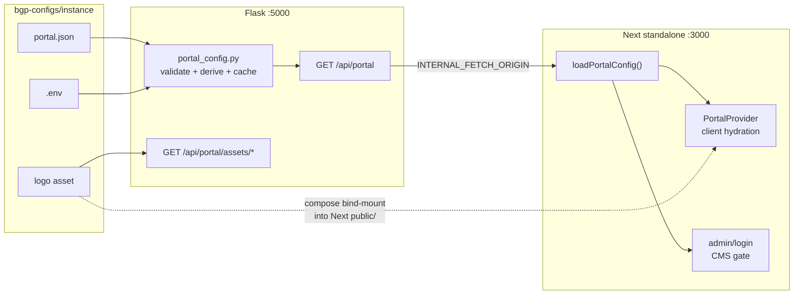

# Portal configuration — how it works

This is the current-state reference for how BioGenome portal branding and feature flags are
configured, loaded, and deployed. For the historical phased refactor that produced this design,
see [front-config-centralization-plan.md](./front-config-centralization-plan.md). For day-to-day
operator steps (rebrand, add instance, roll back), see
[`bgp-configs/docs/runbook.md`](../../bgp-configs/docs/runbook.md).

---

## 1. Architecture overview

One source of truth per instance: `bgp-configs/biogenome-portal-<instance>/portal.json`.
Flask validates it, derives a few authoritative fields from its own env, and serves it over
`GET /api/portal`. Next.js loads that document during SSR and hydrates the client through
`PortalProvider`. Branding edits are mount edits — no front-end rebuild.



Logos today are still bind-mounted into the Next container's `public/` (see instance
`docker-compose.yml`); Flask's `GET /api/portal/assets/*` is implemented but the front-end
footer helper does not call it yet (`footerLogoPublicUrl.ts`).
**Front-end container contract (production):**

| Variable | When set | Purpose |
| --- | --- | --- |
| `NEXT_PUBLIC_BASE_PATH` | build arg | Next `basePath` / asset prefix (empty string = root deploy) |
| `INTERNAL_FETCH_ORIGIN` | runtime env | Absolute origin of Flask on the Docker network (e.g. `http://erga_server:5000`) |

Nothing else is required for branding. Feature flags (`cms`, `goat`, `map`, `showCountries`, …)
live in the mounted `portal.json`.

---

## 2. `portal.json`

### Where it lives

- **Canonical schema:** [`bgp-configs/portal.schema.json`](../../bgp-configs/portal.schema.json)
- **Bundled copies (must stay byte-identical):**
  - `biogenome-portal/front/portal.schema.json` (editor / types alignment)
  - `biogenome-portal/server/portal.schema.json` (Flask validation; the backend image only ships
    `server/`)
- **CI sync gate:** `bgp-configs/.github/workflows/build-next-front-ecr.yml` job
  `check-schema-sync` diffs all three and fails the build on drift.
- **Per-instance documents:** `bgp-configs/biogenome-portal-*/portal.json`

### What belongs in the file

Typical keys under `general`: `title`, `titleHighlight`, `description`, `languages`, `cms`,
`goat`, `goatProjectLink`, `contactEmail`, `externalLink`, `showCountries`, `map`, optional
`matomo` (schema-ready; not yet wired into the Next Matomo tracker — still build-arg based).

Also: `theme.colors`, optional `models.*` overrides, `footer` (including `logoUrl`), optional
`cms.organisms.requiredSteps`.

### What does *not* belong in the file

| Field | Why |
| --- | --- |
| `general.apiBase` | Derived at runtime: browser uses `origin + basePath + /api`; server uses `INTERNAL_FETCH_ORIGIN + /api` (`front/lib/api/taxon.ts`) |
| `general.rootTaxid` | Owned by Flask `ROOT_NODE`; front fetches `GET /api/taxons/root` |
| `general.basePath` | Next `basePath` is a **build-time** constant from `NEXT_PUBLIC_BASE_PATH` — not re-readable from JSON |

---

## 3. Backend authority

Implementation: [`server/services/portal_config.py`](../server/services/portal_config.py),
[`server/rest/portal.py`](../server/rest/portal.py).

### Mounts (every instance `*_server`)

```yaml
- ./portal.json:/server/configs/portal.json:ro
- ./<Logo>:/server/configs/assets/<Logo>:ro   # when the instance has a logo
```

Override path via `PORTAL_CONFIG_PATH` (default `/server/configs/portal.json`). Assets via
`PORTAL_ASSETS_PATH` (default `/server/configs/assets`).

### Load / validate / derive

1. Read the mounted JSON (or fall back to bundled `server/portal_default.json` if missing).
2. Validate against the bundled schema — invalid JSON or schema violations fail loudly
   (`PortalConfigError`); a missing file only warns and uses the default.
3. Override / derive from Flask env (never the reverse):
   - `general.rootTaxid` ← `ROOT_NODE`
   - `general.goat` ← `bool(GOAT_PROJECT_NAME)`
   - `general.cms` stays from the file (UI policy, not a backend fact)
4. Cache per process, revalidated on file `mtime` change (no Flask restart needed to pick up an
   edited mount).

### Endpoints

| Method | Path | Notes |
| --- | --- | --- |
| `GET` | `/api/portal` | JSON config; `ETag` + `Cache-Control: public, max-age=30`; real `304` |
| `GET` | `/api/portal/assets/<filename>` | Logo/static assets via `send_from_directory`; long cache. Implemented on Flask; the Next footer still loads logos from `public/` mounts today (not this path). |

Both are public (no JWT) — the config document is branding, not secrets.

---

## 4. Frontend consumption

### SSR (primary path)

[`front/lib/portal/portalServer.ts`](../front/lib/portal/portalServer.ts) — `loadPortalConfig()`:

1. `GET {INTERNAL_FETCH_ORIGIN}/api/portal` via `getApiBase()`, with
   `next: { revalidate: 30, tags: ['portal'] }`.
2. On any failure, fall back through the Phase 3 disk chain:
   `${PORTAL_CONFIG_DIR:-/config}/portal.json` → `public/portal.json` → compiled
   `defaultPortal.json`, and log a clear `console.warn`.

`app/layout.tsx` (and a few other server pages) call `loadPortalConfig()` and pass the result
into `Providers` as `initialPortal`. Root taxid is loaded the same way via `loadRootTaxid()` →
`GET /api/taxons/root`.

### Client

Normal path: hydrated from `PortalProvider` — no client fetch of `portal.json`.
Fallback for edge cases: `GET {basePath}/api/portal-config` (Next route handler that also calls
`loadPortalConfig()`), so SSR and the client share one resolver.

### CMS gating (single source)

There is no Edge middleware for CMS. `app/admin/layout.tsx` and `app/login/page.tsx` are
async server components that call `loadPortalConfig()` and `redirect('/')` when
`general.cms !== true`. The existing client-side JWT session probe (`AdminLayoutClient`) is
unchanged and only runs after the CMS-enabled gate passes.

Flipping `general.cms` in the mounted file takes effect after the Next data-cache revalidate
window (~30s) — no rebuild, no env change.

### Local development helpers (not production)

- `bgp-configs/scripts/prep-branding.sh` — stages an instance's `portal.json` + logos into
  `front/branding/` for local preview.
- `front/scripts/bake-portal.mjs` — merges defaults + branding + optional env overrides
  (`NEXT_PUBLIC_CMS`, `PORTAL_GOAT`, `PORTAL_MAP`, `PORTAL_SHOW_COUNTRIES`) into
  `public/portal.json` for `npm run dev`. **Not** run in the Docker image build; those env
  names are bake-only and are not Dockerfile build args.

---

## 5. basePath and images

Next.js resolves `basePath` at **build time** and inlines it into route manifests, client
chunks, and asset URLs. It cannot be swapped at container start without rewriting those
artifacts (Option B) or eliminating it via per-instance hostnames (Option C). This project
uses **Option A**: one Dockerfile, one commit, N thin images that differ only in
`NEXT_PUBLIC_BASE_PATH`.

### Subpath deploys (seven instances on `genome.crg.*`)

| Piece | Example (`erga`) |
| --- | --- |
| Build | `NEXT_PUBLIC_BASE_PATH=/erga` → tag `portal_next_erga` |
| CI | `bgp-configs` matrix in `build-next-front-ecr.yml` |
| Traefik UI | `PathPrefix('/erga')` priority 10 → Next `:3000` |
| Traefik API | `PathPrefix('/erga/api')` priority 100 + `stripprefix=/erga` → Flask `:5000` |
| `.env` | `BASE_PATH=/erga` (used for annotation download URLs and the deploy-consistency check) |

### Root deploy (CBP production on `dades.biogenoma.cat`)

Modeled on `biogenome-portal-cbp-demo`, but with empty basePath — same hostnames as before the
migration.

| Piece | Value |
| --- | --- |
| Build | `NEXT_PUBLIC_BASE_PATH=` (empty) → tag `portal_next_cbp` |
| CI | `biogenome-portal/.github/workflows/build-and-push-ecr.yml` (not the `bgp-configs` matrix) |
| Traefik UI | `Host(dades\|data.biogenoma.cat)` priority 10 → Next `:3000` |
| Traefik API | same Host + `PathPrefix('/api')` priority 100, **no** stripprefix → Flask `:5000` |
| `.env` | no `BASE_PATH` |

Flask routes are registered as literal `/api/...` paths (`server/routes.py`), so a root deploy
forwards `/api` unchanged; subpath deploys strip the instance prefix first.

The CBP production compose/`.env`/`portal.json` migration is **drafted in the working tree and
not yet deployed**. See Phase 7 / Open Decision 5 in the plan doc and the operator call-outs in
[`bgp-configs/docs/runbook.md`](../../bgp-configs/docs/runbook.md).

---

## 6. Validation and CI

| Check | Where |
| --- | --- |
| Schema validation of every `portal.json` | `bgp-configs/scripts/validate-portal-configs.py` + `validate-portal-configs.yml` |
| Subpath `BASE_PATH` ↔ Traefik `PathPrefix` agreement | same script (`ROOT_DEPLOY_INSTANCES` skipped) |
| Three schema copies byte-identical | `build-next-front-ecr.yml` → `check-schema-sync` |
| Matrix build of all subpath Next images | `build-next-front-ecr.yml` (input: `portal_ref` only) |

---

## 7. Explicitly out of scope (for now)

- **Option B** (runtime sentinel basePath rewrite) and **Option C** (per-instance hostnames) —
  not implemented; Option A is the shipping strategy.
- **Shared Compose fragment** (`include:` / templating) — deferred until deploy-host Compose
  CLI versions and copy semantics are confirmed (see Phase 7 note in the plan doc).
- **Matomo via `portal.json`** — `general.matomo` exists in the schema but the Next tracker
  still reads `NEXT_PUBLIC_MATOMO_*` build args.
- **Deploying the CBP migration** — files are staged for review; production cutover requires
  an explicit operator approval and a maintenance window.
