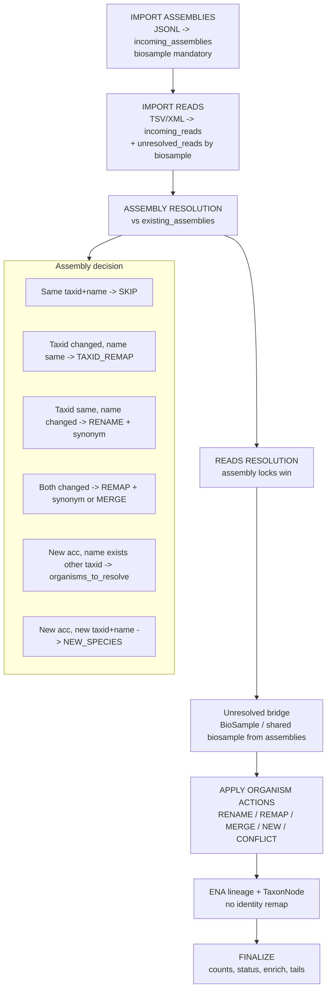
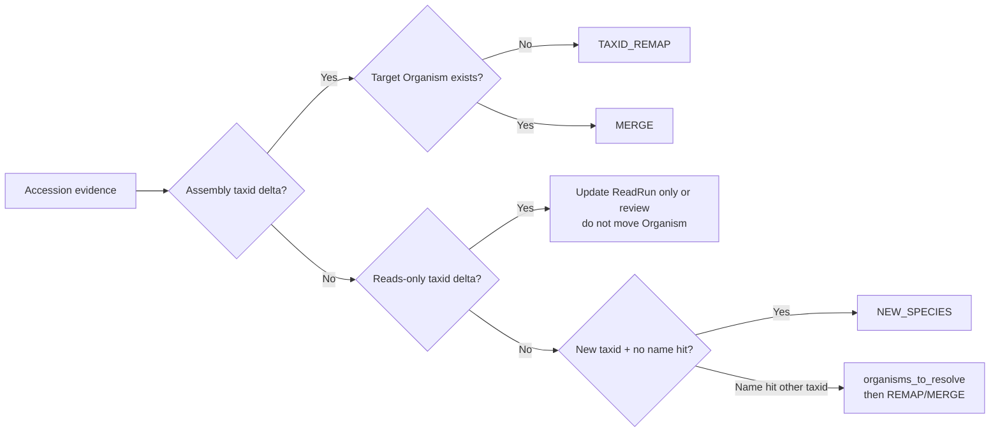

# NEW BGP PIPELINE - catalog-first ingest + taxonomy reconcile

Design draft for a unified assemblies/reads import pipeline where **catalog evidence**
(accessions) drives Organism identity changes, **assemblies outrank reads** on mismatch,
and ENA is used for lineage / TaxonNode after identity is settled - not for speculative
taxid remaps.

Related: current behavior is documented in `taxonomy-refresh-pipeline.md` and
`docs/celery-jobs/ingest-pipeline.md`. This file is the **target** design, not the live code.

---

## Goals

1. Import assemblies and reads first; collect structured evidence dictionaries.
2. Resolve Organism changes only from accession-level evidence (lazy identity).
3. Prefer stale-but-consistent over speculative remaps / name-suffix duplicates.
4. Assemblies have higher weight than reads when taxid/name disagree.
5. Renames go to a **synonyms timeline** on `Organism` (no `[NCBI:taxid]` on canonical name).
6. Explicit **MERGE** when two organisms collapse onto one taxid.

---

## Authority and weights

| Signal | Weight | Can move Organism.taxid? |
|---|---|---|
| Assembly accession taxid delta | 100 | Yes (auto if unambiguous) |
| ReadRun accession taxid delta | 10 | No alone - review or align to assembly |
| BioSample taxid hint | 1 | No (fills unresolved reads only) |
| ENA taxonomy refresh | 0 for identity | Lineage / ranks / suggestions only |

**Rule:** auto REMAP/MERGE requires assembly evidence (`weight >= 100`). Reads-only drift never remaps Organism by itself.

---

## End-to-end order

```text
IMPORT ASSEMBLIES  ->  IMPORT READS  ->  ASSEMBLY RESOLUTION  ->  READS RESOLUTION
  ->  BIOSAMPLE BRIDGE (unresolved)  ->  APPLY ORGANISM ACTIONS  ->  ENA LINEAGE
  ->  PROPAGATE CATALOG  ->  FINALIZE
```

Assemblies and reads imports may run as separate Celery tasks, but **resolution must see both
incoming dicts + existing DB state**, and assembly resolution always runs before reads
resolution (or reads resolution must treat "already resolved this run by assembly" as locked).

---

## Phase A - IMPORT ASSEMBLIES

### A1. Store JSONL

- Fetch/write NCBI datasets JSONL (current staging/SQLite pattern can stay).
- Persist raw/temp file for re-run; do not create Organism yet.

### A2. Collect assemblies dict (biosample **mandatory**)

```text
incoming_assemblies:
  ass_acc -> { taxid, scientific_name, biosample_accession }
```

**Hardening vs current code:**

- Today: rows without taxid are skipped; biosample is optional for persist.
- Target: **skip row if `biosample_accession` is missing or empty** (mandatory link for
  later reads/biosample bridge). Log skipped accessions with reason `missing_biosample`.
- Also skip if `taxid` or `scientific_name` empty (cannot form evidence).
- Normalize: `taxid` / names stripped; name comparison later is case-insensitive for match,
  case-preserving for storage.

### A3. Collect biosamples dict from assembly metadata

```text
incoming_biosamples_from_asm:
  biosample_acc -> { parsed metadata..., taxid?, scientific_name? }
```

- Used later to resolve BioSample documents and to help unresolved reads.
- Does not create Organism.

---

## Phase B - IMPORT READS

### B1. Store XML / TSV

- Current path uses ENA filereport TSV; XML is fine if that becomes the source - same
  collection shape either way.
- Persist ReadRun rows; taxid may be pending/placeholder (as today).

### B2. Collect unresolved reads (no usable taxid/name)

```text
unresolved_reads:
  biosample_acc -> [read_acc_1, read_acc_2, ...]
```

- Include runs with missing/pending taxid or placeholder scientific_name.
- Require `biosample_acc` (sample_accession); if missing, put in
  `orphan_reads_no_sample` for manual/NCBI SRA backfill (existing NCBI fill path).

### B3. Collect reads dict (resolved in payload)

```text
incoming_reads:
  read_acc -> { taxid, scientific_name, biosample_acc }
```

- Only rows with both taxid and scientific_name usable.
- Do not create Organism yet.

---

## Phase C - ASSEMBLY RESOLUTION (priority path)

### C0. Load existing assemblies evidence

```text
existing_assemblies:
  ass_acc -> { taxid, scientific_name, biosample_accession, organism_taxid? }
```

Load only fields needed; keyed by accession (stable identity).

### C1. Iterate `incoming_assemblies`

For each `ass_acc`, produce **actions** (do not apply Organism writes until Phase E batch
apply - collect first so merges can be de-duplicated).

### C2. Evidence matrix - accession already in DB

| Incoming vs existing | Action |
|---|---|
| taxid equal AND scientific_name equal (ci) | **SKIP** (optional: refresh assembly metadata only) |
| taxid **differs** AND scientific_name equal (ci) | **TAXID_REMAP** - evidence that this assembly's species taxid moved. Queue `taxid_updates[old_taxid] -> new_taxid` with weight 100, source=`assembly`, accession=`ass_acc`. Also update assembly row taxid on apply. |
| taxid equal AND scientific_name **differs** | **RENAME** - set Organism canonical name to incoming; append previous name to `synonyms[{name, at, source: assembly}]`; refresh lineage from ENA for this taxid (genus+ may have changed even if taxid stable). Update assembly scientific_name. |
| taxid **differs** AND scientific_name **differs** | **BOTH** - treat as TAXID_REMAP first (accession is ground truth for taxid). On apply: move taxid, set new canonical name, old name -> synonyms. If target taxid already has another Organism -> **MERGE** (see Phase E). Do **not** skip; do **not** invent a second Organism. |

### C3. Evidence matrix - accession **not** in DB (new assembly)

| Organism state | Action |
|---|---|
| `exists(taxid)` AND `exists(scientific_name)` matching incoming (ci) | **ATTACH** - store new assembly under that taxid; no Organism change |
| `exists(taxid)` AND Organism name differs from incoming | **RENAME** (or attach + synonym if you prefer ENA name as canonical - decide: **catalog/assembly name wins for canonical** when evidence is assembly; ENA name can be synonym). Update lineage. Store assembly. |
| `!exists(taxid)` AND `exists(scientific_name)` on another Organism | **NAME_HIT_OPEN_TAXID** - do **not** create Organism yet. Put in `organisms_to_resolve`: `{ scientific_name, new_taxid, ass_acc, biosample_acc, source: assembly }`. Likely remap/merge of existing species; confirm via biosample/reads cluster before creating a twin. Store assembly **pending** or store with new taxid only after resolve. |
| `!exists(taxid)` AND `!exists(scientific_name)` | **NEW_SPECIES** - create Organism after ENA validate for taxid; store assembly |
| `exists(taxid)` AND `!exists(scientific_name)` as organism field empty | Treat as RENAME/fill name + synonyms if replacing a placeholder |

**Hardening - missing from your draft:**

- Explicit **BOTH** (taxid + name changed on same accession).
- **MERGE** when remap target taxid already owned.
- Defer Organism create when name exists under another taxid (`organisms_to_resolve`) - this is the anti-duplicate rule that replaces `[NCBI:...]` suffix.
- Collect actions first; apply in Phase E with deterministic ordering.

### C4. Store / update assembly documents

- New accessions: insert with resolved taxid/name after action classification (or insert with
  incoming values and patch taxid in same apply batch - prefer one write).
- Existing accessions: `$set` taxid / scientific_name / metadata as needed.

---

## Phase D - READS RESOLUTION (assembly-locked)

### D0. Load existing reads evidence

```text
existing_reads:
  read_acc -> { taxid, scientific_name, biosample_acc }
```

Also load **assembly resolution locks** from this run:

```text
locked_by_assembly:
  taxid / biosample_acc / organism_id -> winning { taxid, scientific_name }
```

Reads must not override these.

### D1. Iterate `incoming_reads`

### D2. Evidence matrix - read already in DB

| Incoming vs existing | Action |
|---|---|
| taxid equal AND name equal (ci) | **SKIP** |
| taxid **differs** AND name equal (ci) | If assembly lock exists for this biosample/organism -> **ALIGN_READ_TO_ASSEMBLY** (force read to assembly winner). Else if any Assembly for same organism/biosample still on old taxid -> **SKIP organism**, optionally align read to assembly. Else -> **READS_ONLY_REMAP_CANDIDATE** -> **review queue** (weight 10, no auto Organism taxid change). Still update ReadRun row taxid if you trust the payload for the run itself, or hold until review. **Safe default:** update ReadRun document to incoming taxid for catalog accuracy, but **do not** remap Organism. |
| taxid equal AND name **differs** | If assembly lock on name -> assembly name wins; else **RENAME** Organism only if no assembly disagrees; append synonym. |
| taxid **differs** AND name **differs** | Same as taxid-differs branch; never create second Organism from reads alone. |

### D3. Evidence matrix - new read accession

| State | Action |
|---|---|
| Biosample/assembly already resolved this run | **ATTACH** to locked taxid/name (ignore weaker read disagreement) |
| `exists(taxid)` organism | **ATTACH** (rename rules as above, assembly priority) |
| `!exists(taxid)` AND `exists(scientific_name)` | Add to `organisms_to_resolve` (same as assemblies); prefer waiting for assembly evidence |
| `!exists(taxid)` AND unresolved | Keep / move to `unresolved_reads[biosample]` |
| True new species (no name hit, no assembly) | **NEW_SPECIES** only if taxid+name present and ENA validates; lower confidence than assembly-created species |

### D4. Unresolved reads bridge

For each `biosample_acc` in `unresolved_reads`:

1. If BioSample (from assembly metadata or ENA BioSamples API) has taxid+name -> fill ReadRuns; then re-enter D2/D3 logic.
2. Else if an Assembly shares `biosample_acc` -> copy assembly taxid/name onto those reads (**assembly wins**).
3. Else leave pending; do not invent Organism.

---

## Phase E - APPLY ORGANISM ACTIONS (batch, ordered)

Collapse per-accession evidence into per-organism operations:

### E1. Deduplicate

- Multiple assemblies saying `1 -> 2` -> one REMAP.
- If any assembly says `1 -> 2` and any says `1 -> 3` -> **CONFLICT** (review); apply nothing to Organism.
- Assembly REMAP + reads REMAP disagree -> assembly wins; align reads.

### E2. Action types

| Action | Steps |
|---|---|
| **SKIP** | Nothing |
| **RENAME** | synonyms += old name + timestamp + source; set scientific_name; ENA lineage refresh for taxid; propagate name to catalog rows with that taxid |
| **TAXID_REMAP** (target free) | Organism.taxid old->new; synonyms if name also changed; update_many all catalog old->new; lineage for new taxid; soft-check unique indexes first |
| **MERGE** (target owned) | Survivor = Organism with winning taxid (usually target). Union synonyms + curated fields. Move catalog from loser taxid. Soft-retire loser (`merged_into`, `merged_at`). Audit log. Never suffix canonical name. |
| **NEW_SPECIES** | ENA fetch for taxid; insert Organism; no name suffix; if unique name collision with different taxid -> should have been NAME_HIT_OPEN_TAXID / MERGE path instead |
| **CONFLICT** | Persist review record; leave Organism as-is |

### E3. Safe apply order (no multi-doc transaction)

1. Pre-check unique `taxid` / `scientific_name`.
2. Organism write(s).
3. Catalog `update_many` (Assembly, ReadRun, BioSample, GenomeAnnotation, LocalSample, SampleCoordinates).
4. Soft-retire loser if MERGE.
5. Audit + metrics.

Idempotent: re-run with same incoming dicts yields SKIP.

### E4. Curator vs INSDC on MERGE

- Final **taxid** = catalog/assembly winner.
- **Survivor shell** prefers curator-rich document when merging (keep CMS fields).
- Field merge: union lists (publications, images, common_names); curated scalars win if set; lineage/INSDC status from winner taxid; recompute counts/IUCN after.

---

## Phase F - ENA LINEAGE (non-identity)

For every touched taxid (renamed, remapped, merged survivor, new):

1. Fetch / ensure TaxonNode + `taxon_lineage`.
2. Do **not** change Organism.taxid from ENA-only heuristics.
3. Optional: if ENA suggests a different taxid than catalog -> write **suggestion** to review queue only.

Demote current `helpers_refresh_taxonomy` identity remaps to this suggestion mode, or restrict refresh to lineage/rank/`TaxonNode` only for catalog-backed species.

---

## Phase G - FINALIZE

Same spirit as current ingest finalize:

1. Propagate lineage to catalog (`bulk_copy_organism_lineages_to_catalog`).
2. Guarded prune of lineage-empty organism stubs (only if no catalog rows).
3. `delete_rows_without_organism` for this batch if still needed.
4. Counts, GoaT/INSDC status, enrich (IUCN: try canonical name then synonyms).
5. Geolocation, BlobToolKit, Annotrieve (assembly path).

---

## Model additions (required for this design)

```text
Organism.synonyms: [
  { name, normalized_name, first_seen, last_seen, source }  # source: assembly|read|ena|merge|manual
]

Organism.merged_into: str | null      # taxid of survivor
Organism.merged_at: datetime | null

# Optional review collection
TaxonomyReview: {
  status, evidence[], proposed_action, created_at, resolved_at, notes
}
```

- Keep unique index on **current** `scientific_name` and `taxid`.
- Index `synonyms.normalized_name` for lookup.
- Stop using `" [NCBI:{taxid}]"` suffix in ingest/refresh.

---

## Comparison to current flow (gaps this closes)

| Current | New |
|---|---|
| `handle_full_taxonomy_from_taxids` creates Organism for every new taxid immediately | Create only after evidence classification (NEW / REMAP / MERGE) |
| Name collision -> `[NCBI:...]` suffix | Synonyms + MERGE / resolve-by-name deferral |
| Taxonomy refresh infers remap via ENA name bridge | Remap only from assembly accession taxid delta |
| Reads can bootstrap organisms independently | Assembly priority; reads-only = no Organism taxid move |
| Biosample optional on assemblies | Biosample **mandatory** for assembly evidence rows |
| No explicit MERGE | MERGE when target taxid already has Organism |

---

## Mermaid - full pipeline



## Mermaid - identity decision (assembly vs reads)



---

## Metrics / observability (return dict)

```text
assemblies_skipped_missing_biosample
assemblies_skip / rename / taxid_remap / merge / new / conflict
reads_skip / aligned_to_assembly / organism_blocked_reads_only / unresolved_filled / unresolved_remaining
organisms_to_resolve_count
synonyms_appended
ena_lineage_refreshed
reviews_opened
```

---

## Open decisions (resolve before implementation)

1. **Canonical name source on RENAME:** assembly payload vs ENA scientificName (recommendation: assembly wins when action is assembly-driven; store ENA name as synonym if different).
2. **Pending assemblies** when `organisms_to_resolve`: insert Assembly with incoming taxid immediately vs hold until resolve (recommendation: insert with incoming taxid, Organism create deferred - catalog can exist briefly without Organism if you allow it, or attach after resolve in same job).
3. **Reads-only taxid update on ReadRun document:** always write payload taxid to the run, or only when it matches assembly (recommendation: write payload to ReadRun; never promote to Organism without assembly weight).
4. **Whether unified Celery chord** runs assemblies+reads together vs separate jobs with shared reconcile module (recommendation: shared `catalog_taxonomy_reconcile.py`; assembly job runs full C->E; reads job runs D->E with assembly locks loaded from DB).
5. **Migration** of existing `[NCBI:...]` names into synonyms.

---

## Implementation sketch (modules)

```text
jobs/support/catalog_evidence.py      # build incoming/existing dicts
jobs/support/catalog_taxonomy_reconcile.py  # classify + apply REMAP/MERGE/RENAME/NEW
jobs/assemblies.py                    # Phase A + C + call reconcile apply
jobs/reads.py                         # Phase B + D + call reconcile apply
db/embedded_docs.py                   # OrganismSynonym
db/model.py                           # synonyms, merged_into, merged_at
```

---

## Safety checklist

- [ ] No Organism create on taxid alone when scientific_name already belongs to another taxid
- [ ] No Organism taxid change from reads-only evidence
- [ ] Assembly vs reads mismatch -> assembly wins; align reads
- [ ] BOTH changed on accession -> REMAP/MERGE, not skip
- [ ] MERGE instead of skip when target taxid exists
- [ ] Synonyms timeline instead of name suffix
- [ ] Biosample mandatory on assembly evidence rows
- [ ] Apply Organism before catalog propagate; idempotent re-run
- [ ] ENA does not override catalog identity
- [ ] Dry-run mode: classify actions + metrics without writes (first rollout)
